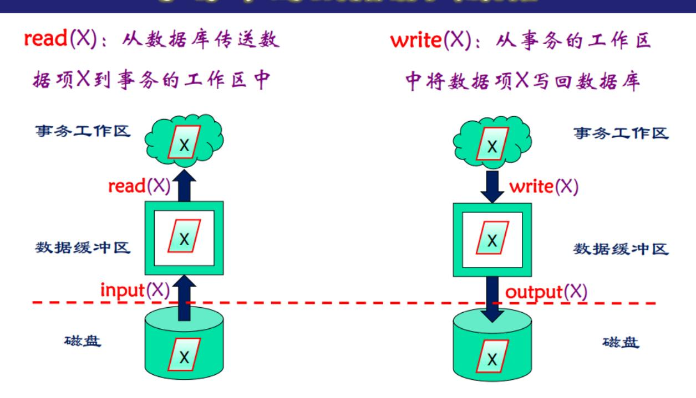

# 事务
---
## 事务的概念

- 事务是由⼀系列操作序列构成的执⾏单元,这些操作要么都做,要么都不做,是⼀个不可分割的⼯作单位
- SQL中事务的定义
  - 事务以 Begin transaction 开始 , 以Commit transaction或 Rollback transaction结束
  - Commit transaction表⽰提交,事务正常结束
  - Rollback transaction表⽰事务⾮正常结束,撤消事务已做的操作,回滚到事务开始时状态
- 事务中的数据访问原语

**NOTE:** write 只是事务和缓冲区之间的交互,并不涉及磁盘操作。磁盘操作由 output 完成。read 和 input 的关系也是如此。什么时候判断事务结束?并不是把数据写⼊磁盘之后才算事务结束,⽽是当⽇志被写⼊磁盘之后就算事务成功执⾏。

## 事务执⾏模式

- 显⽰事务:以begin transaction开始,以commit或rollback结束
- 隐含事务(SQL Server):事务⾃动开始,直到遇到commit或rollback时结束。
  - set implicit\_transactions { ON | OFF }
- ⾃动事务(MySQL):每个数据操作语句作为⼀个事务
  - set autocommit = { 1 | 0 }

# 事务基本特征

- 1. 原⼦性(Atomicity)
  - 事务中包含的所有操作要么全做,要么全不做
  - 原⼦性由恢复机制(⽇志)实现

- 2. 一致性(Consistency)
  - 事务的隔离执行必须保证数据库的一致性
  - 事务开始前,数据库处于一致性状态;事务结束后,数据库必须仍处于一致性状态
  - 数据库一致性状态由用户来负责。如银行转帐前后两个帐户金额之和应保持不变
- 3. 隔离性(Isolation)
  - 系统必须保证事务不受其它并发执行事务的影响
  - 对任何一对事务T1, T2, 在T1看来,T2要么在T1开始之前已经结束,要么在T1完成之后再开始执行:  $T1 \rightarrow T2$  or  $T2 \rightarrow T1$
  - 隔离性通过并发机制实现
- 4. 持久性(Durability)
  - 一个事务一旦提交之后,它对数据库的影响必须是永久的
  - 系统发生故障不能改变事务的持久性
  - 持久性通过恢复机制实现

### 事务调度

事务的执行顺序称为一个调度,表示事务的指令在系统中执行的时间顺序.一组事务的调度必须保证:

- 包含了所有事务的操作指令
- 一个事务中指令的顺序必须保持不变

1. 串行调度
- 在串行调度中,属于同一事务的指令紧挨在一起
- 对于有n个事务的事务组,可以有n! 个有效调度

2. 并行调度
- 在并行调度中,来自不同事务的指令可以交叉执行
- 对于有n个事务的事务组,第 i 个事务有哦  $k_i$  调指令,则有  $\frac{(\sum k_i)!}{\prod k_i!}$  种有效调度
- 当并行调度等价于某个串行调度时,则称它是正确的
- 并行的优点
  - 一个事务由不同步骤组成,所涉及的系统资源也不同。这些步骤可以并发执行,提高系统的吞吐量
  - 系统中存在着周期不等的各种事务,串行会导致难于预测的时延。各个事务涉及数据库的不同部分,采用并发会减少平均响应时间
- 并行的缺点: 有可能破坏数据库的一致性

3. 可恢复调度
- 事务恢复的基本准则
  - 一个事务失败了,应该能够撤消该事务对数据库的影响
  - 如果有其它事务读取了失败事务写入的数据,则该事务应该撤消
- 基本特性:对于每对事务T1与T2,如果T2读取了T1所写的数据,则T1必须先于T2提交。否则当T2提交后,即使T1需要回滚,T2也无法回滚T1所做的修改。

4. 无级联调度
- 级联调度
  - 由于一个事务故障而导致一系列事务回滚
- 无级联调度
  - 对于每对事务T1与T2,如果T2读取了T1所写的数据,则T1必须在T2读取之前提交
  - 无级联调度必是可恢复调度

### 并发调度中的不⼀致现象

1. 丢失修改
两个事务T1和T2读⼊同⼀数据并修改,T1提交的结果破坏了T2提交的结果,导致T2的修改丢失。

2. 读脏数据
事务T1修改某⼀数据并将其写回磁盘,事务T2读取同⼀数据。此后T1由于某种原因被撤消,其已修改过的数据恢复原值,造成T2读到的数据与数据库中数据不⼀致,则T2读到的就是脏数据

3. 不可重复读
事务T2读取某⼀数据后,事务T1对其做了修改,当T2再次读取该数据时,得到与前次不同的值

4. 幻象
事务T2按⼀定条件读取某些数据后,事务T1插⼊⼀些满⾜这些条件的数据,当T2再次按相同条件读取数据时,发现多了⼀些记录

## 事务隔离性级别

为了避免并发调度中的⼀系列数据不⼀致现象。可以定义数据库中的事务隔离级别。事务隔离通过加锁实现。

1. read uncommitted:允许读取未提交的记录
    - read uncommitted 不加任何锁

2. read committed:只允许读取已提交的记录,但不要求可重复读
    - read committed 加读锁,读完⽴即释放,因此会出现不可重复读现象

3. repeatable read:只允许读取已提交的记录,并且⼀个事务对同⼀记录的两次读取之间,其他事务不能对该记录进⾏更新。
    - repeatable read 加读锁,锁在交易结束前不会释放,因此不会出现不可重复读现象。但是会出现幻象现象,因为只锁 了读对应的条⽬,不锁表中其他的条⽬。

4. serializable:调度的执⾏必须等价于串⾏调度
    - serializable 加读锁,且锁全表或者锁索引对应的分⽀,因此不会出现幻象现象。

5. 写锁⼀般都是⻓程锁,即在事务结束前都不会释放。

| 隔离性级别            | 不一致现象 |       |    |      |
|------------------|-------|-------|----|------|
|                  | 读脏数据  | 不能重复读 | 幻象 | 丢失修改 |
| Read uncommitted | 是     | 是     | 是  | 是    |
| Read committed   | 否     | 是     | 是  | 是    |
| Repeatable read  | 否     | 否     | 是  | 否    |
| Serializable     | 否     | 否     | 否  | 否    |

## 快照隔离

加锁是⼀种悲观的并发控制,这种控制⽅法可能会导致不必要的过⾼的预防代价。如果不加锁(乐观并发控制),直接执⾏读 写操作效率更⾼,但是会导致数据不⼀致,此时需要通过回滚⼀⽅事务来解决冲突。

(事务级)快照隔离SI的基本思想:多版本+回滚

- (事务级)快照隔离中读写不会产⽣冲突(应为读的是事务开始时的版本),只有写写会产⽣冲突。
- 对数据库的写发⽣在提交时,形成数据项的⼀个提交版本(快照)
- 执⾏时间和访问数据项有交叠的写事务之间会产⽣冲突,先提交者赢,后提交者回滚。
- 读操作访问该读事务开始那⼀刻的数据项最新版本,读写相互不会阻塞

满⾜快照隔离⼀定满⾜ repeatable read, 满⾜ repeatable read ⼀定满⾜ read committed.

快照隔离在写偏斜(两个事务在重叠的时间写不同的数据项)情况下检测不出冲突,容易导致数据不⼀致。

### 事务级快照隔离**SI**

1. features:
    - 读取操作得到数据项在事务开始时刻最近的已提交版本
    - 通过回滚解决冲突更新操作

2. SQL Server: `alter database my\_db set allow\_snapshot\_isolation on` 只允许发出上述alter语句的连接存在于该数据库, 如果此时还有其他⽤⼾使⽤该数据库,则alter未必被阻塞,但已存在的活动事务会阻塞它。

3. 可重复读

### 语句级快照隔离**RCSI**

- 1. features:
  - i. 读取操作得到数据项在语句开始时刻最近的已提交版本
  - ii. 通过阻塞解决冲突更新操作
- 2. SQL Server: `alter database my\_db set allow\_snapshot\_isolation on` 只允许发出上述alter语句的连接存在于该数据库, 如果此时还有其他⽤⼾使⽤该数据库,则alter未必被阻塞,但已存在的活动事务会阻塞它。
- 3. 不可重复读

## 事务可串⾏化判定

### 冲突可串⾏化

1. 冲突指令:两条指令是不同事务在相同数据项上的操作,并且其中⾄少有⼀个是write指令。⾮冲突指令交换顺序不会影响调度的正确性,即不影响调度是否可串⾏化。
    - read(Q) - read(Q) 不冲突
    - read(Q) - write(Q) 冲突
    - write(Q) - read(Q) 冲突
    - write(P) - write(Q) 不冲突
2. 冲突等价:如果调度 $S$ 可以经过交换⼀系列⾮冲突指令转换成调度 $S'$, 则称调度 $S$ 与 $S'$ 是冲突等价的。
3. 冲突可串⾏化:当⼀个调度 $S$ 与⼀个串⾏调度冲突等价时则称该调度是冲突可串⾏化的
4. 判定算法
    1. 构造优先图(precedence graph):调度 $S$ 的优先图:它是⼀个有向图 $G=(V, E)$, $V$ 是顶点集, $E$ 是边集。顶点集由所有参与调度的事务组成,边集由满⾜下述条件之⼀的边 $Ti\rightarrow Tj$组成:
    - 在 $Tj$ 执⾏ read(Q) 之前, $Ti$ 执⾏ write(Q)
    - 在 $Tj$ 执⾏ write(Q) 之前, $Ti$ 执⾏ read(Q)
    - 在 $Tj$ 执行 write(Q) 之前, $Ti$ 执行 write(Q)

    2. 如果优先图中存在边  $Ti \rightarrow Tj$  ,则在任何等价于 S 的串行调度 S' 中, Ti 都必须出现在 Tj 之前
    3. 如果调度 $S$ 的优先图中有环,则 $S$ 是非冲突可串行化的;如果图中无环,则是冲突可串行化的,事实上,此时可以不断去除树根的事务得到等价的串行调度。

### 视图可串行化

视图等价的根本思想: 只要对于仟何的输入,调度的输出是相同的,则称调度是等价的。

1. 视图等价的调度:考虑关于某个事务集的两个调度S, S', 若调度S, S'满足以下条件,则称它们是视图等价的:
    1. 数据库初值  $\stackrel{S}{\rightarrow}  ri(Q) $ $\wedge$  数据库初值  $\stackrel{S'}{\rightarrow} ri(Q) $
    2. $wj(Q) \stackrel{S}{\rightarrow} ri(Q) \land wj(Q) \stackrel{S'}{\rightarrow} ri(Q)$
    3. $wi(Q) \overset{S}{\to}$  数据库终值  $\wedge wi(Q) \overset{S'}{\to}$  数据库终值

    条件 1.2 保证从...读一致性,条件 3 保证两个调度得到最终相同的系统状态。

2. 视图可串行化
- 如果某个调度视图等价于一个串行调度,则称该调度是视图可串行化的
- 冲突可串行化调度一定是视图可串行化的
- 存在视图可串行化但非冲突可串行化的调度
- 存在可串行化但非冲突可串行化的调度

3. 判定算法
    1. 构造带标记的优先图:设调度 S = T1, T2, ..., Tn,构造两个虚事务 Tb, Tf,其中 Tb 为 S 中所有 write(Q) 操作,Tf 为 S 中所有 read(Q) 操作。在调度 S 的开头插入 Tb,在调度 S 的末尾插入 Tf,得到新的调度 S' (Tb), Tf 是为了让从写冲突的表达形式一致
       - 如果 Ti 读取 Ti 写入的数据项的值,则加入边  $Ti \stackrel{0}{\rightarrow} Ti$
       - 如果在优先图中不存在从 Ti 到 Tf 的通路,则 Ti 是无用事务,将其删除
       - 对于每个数据项 Q, 如果 Tj 读取 Ti 写入的 Q 值, Tk执行 $write(Q)$ 且 $Tk \neq Tb$ , 则:
            a) 如果 Ti = Tb且  $Tj \neq Tf$  在优先图中插入边  $Tj \stackrel{0}{\rightarrow} Tk$
            b) 如果  $Ti \neq Tb$ 且 Tj = Tf 在优先图中插入边  $Tk \stackrel{0}{\rightarrow} Ti$
            c) 如果  $Tj \neq Tb$ 且  $Tj \neq Tf$  在优先图中插入边  $Tj \stackrel{p}{\to} Tk$  和  $Tk \stackrel{p}{\to} Ti$ ,其中 p是一个唯一的,在前面边的标记中未曾用过的大于0的整数。

            这一步加边的意义是即使指令是冲突的,也可能满足视图等价的条件。比如 T1,T2 中两个写操作,(c) 中加边的 方式是指等价的串行调度可能 T1 在 T2 之前,也可能 T2 在 T1 之前,比如在 T3 中又有一条对同一数据项的写 指令是作为该数据项最终的写指令,那么 T1, T2 中的这两条指令先后并不重要,因为都会被 T3 覆盖掉,所以可以等价为一个串行调度。

    2. 从所有标记大于0的边中选取其中每类之一和所有标0边共同构成优先图,如果优先图中不存在环,则该类边是视图可串行化的,否则是非视图可串行化的。假设有 n 类边(p=1,2,...,n),则有 2n 种可能的调度,每个调度都要进行一次判定。