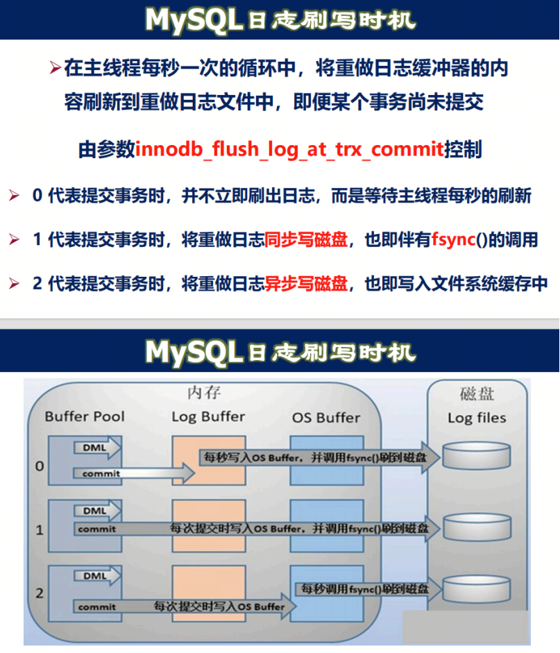
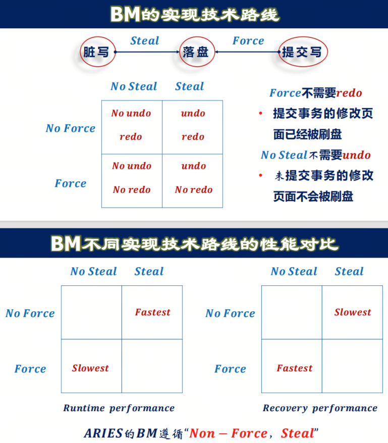
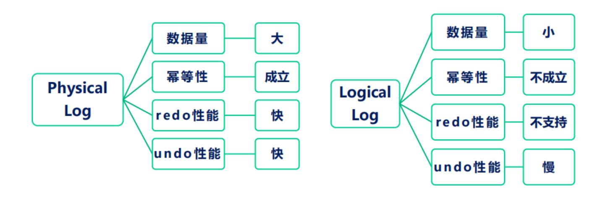
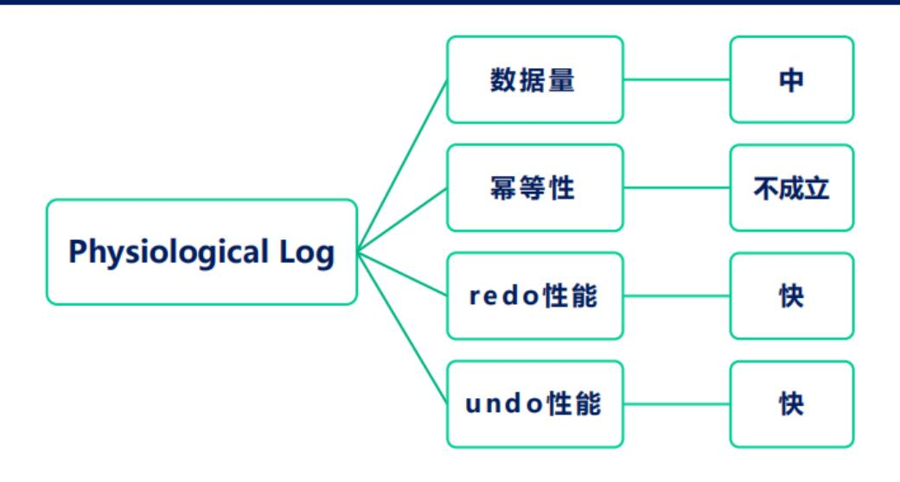

# 系统故障
---

## 故障类型

1. 事务故障:单个事务的运⾏没有到达预期的终点就被中⽌
- ⾮预期故障
  - 不能由事务程序处理的
  - 如运算溢出,发⽣死锁⽽被选中撤消该事务
- 可预期故障
  - 应⽤程序可以发现的事务故障,并且应⽤程序可以让事务回滚
  - 如转帐时发现帐⾯⾦额不⾜

2. 系统故障,软故障(soft crash)
    在硬件故障、软件错误的影响下,虽引起内存信息丢失,但未破坏外存中数据。如CPU故障、突 然停电DBMS, OS, 应⽤程序等异常终⽌。

3. 介质故障,硬故障(hard crash)
    ⼜称磁盘故障,破坏外存上的数据库,并影响正在存取这部分数据的所有事务如磁盘的磁头碰撞 或瞬时的强磁场⼲扰。

### 故障恢复:

- 恢复是把数据库从错误状态恢复到某⼀正确状态的功能,从⽽确保数据库的⼀致性
- 恢复的基本原理是冗余,即数据库中任⼀部分的数据可以根据存储在系统别处的冗余数据来重建

## 备份

### 转储

转储是将数据库复制到磁带或另⼀个磁盘上保存起来的过程,这些备⽤数据称为后备(后援)副本

- 静态转储:转储期间不允许对数据库进⾏任何存取、修改活动
- 动态转储:转储期间允许对数据库进⾏存取或修改
- 海量转储:每次转储全部数据库
- 增量转储:每次只转储上次转储后更新过的数据

## ⽇志

⽇志⽂件是以事务为单位⽤来记录数据库的每⼀次更新活动的⽂件,由系统⾃动记录。⽇志内容包 括:记录名、旧记录值、新记录值、事务标识符、操作标识符等。

过程:
1. 事务 $Ti$ 开始时,写⼊⽇志: $\langle Ti\;\; start\rangle$
2. 事务 $Ti$ 执⾏ write(X) 前,写⼊⽇志: $\langle Ti, X, V1, V2\rangle$, V1是X更新前的值(前像), V2是X更新后的值(后像)
3. 事务 $Ti$ 结束后,写⼊⽇志: $\langle Ti\;\; commit\rangle$

**NOTE:** 1. 实际上并没有第⼀步,找到该事务的第⼀条⽇志就是开始事务的⽇志。 2. 不记录读操作,只记录写操作。3. 记录前后值是物理⽇志,记录具体操作是逻辑⽇志(⽐如 x=x-10)。物理⽇志具有幂等性,重做任意次结果都不变。

基于⽇志记录的事务分类:
- 圆满事务:⽇志⽂件中记录了事务的标识
- 夭折事务:⽇志⽂件中只有事务的标识,⽆标识 当需要恢复数据库的时候,redo 圆满事务,undo 夭折事务。

## 其他⽇志恢复技术

### 1. 提交⽇志(Commit Logging)

特点:
- 脏数据不会持久化
- 只有redo记录,没有undo记录
- 提交时将事务⽇志都刷写到磁盘 

规则:
- 事务提交之前,其修改结果不会写⼊磁盘
- ⽇志中没有提交标记的事务,其修改结果没有写盘
- 恢复时只需重做⽇志中的提交事务
- 实际产品:OceanBase、Hekaton(SQL Server 内存存储引擎)

### 2. ⽆⽇志恢复技术(shadow paging)

原理:

- 被修改的数据会同时存在两份,⼀份修改前的数据,⼀份是修改后的数据,称为影⼦(Shadow)
- 系统通过两个⽬录结构分别指向修改前的数据和修改后的数据,最后 Current 指针原⼦切换到新的⽬录上,表⽰事务提交成功
- 当事务提交时,以⼀次原⼦数据写⼊让整个事务新的修改⽣效
- 如果在事务提交前出现系统故障,数据库恢复时⻅不到未完成事务的修改,硬盘上的这个事务曾经修改的数据也会由垃圾回收模块回收
- 持久性保证:事务的修改直接持久化在硬盘上,⽆需⽇志⽀持

## WAL (Write Ahead Log)

事务中的数据访问原语:

- read(X):从数据库缓冲区(内存)传送数据项X到事务的⼯作区(内存)中
- write(X):将事务⼯作区(内存)中的数据项X的值写回数据库缓冲区(内存)
- input(X):从外部存储(磁盘)中读⼊数据项X到数据库缓冲区(内存)中,由缓冲区管理器发出
- output(X):将数据库缓冲区(内存)中的数据项X的值写回外部存储(磁盘)中,由缓冲区管理器发出

WAL原则:对于尚未提交的事务,在将数据缓冲区写到外存之前,必须先将⽇志缓冲区内容写到外存去。

⽇志缓冲区和数据库缓冲区的写时机不同:

1. 同步(synchronous)写⽇志: 
    只有事务的相关⽇志已经完全在磁盘上了,才会向进程发送该事务已提交的确认消息
2. 异步(asynchronous)写缓冲区:
    只需要将数据⻚的写⼊操作投递给操作系统即可,不需要等待其完成。实际上,操作系统只会在内存⻚被置换出内存时才会将其写回磁盘。如果内存空间⼀直有空余,那么数据缓冲区也⼀直不 会被写⼊磁盘。

总得来说,⽇志已经代表了数据库的所有数据,并不⼀定需要存储实际的数据。

MySQL组提交
- fsync是昂贵操作,MySQL⼀次事务提交最多会导致3次fsync
- 组提交:将多个并发提交的事务共享⼀次fsync操作
  - binlog\_group\_commit\_sync\_delay = N: 在等待N 微秒后,进⾏binlog刷盘操作
  - binlog\_group\_commit\_sync\_no\_delay\_count = N: 达到最⼤事务等待数量,开始binlog刷盘

## 故障恢复
### 事务故障恢复:撤消事务已对数据库所做的修改

事务故障恢复过程

- 反向扫描⽇志⽂件,查找该事务的更新操作
- 对事务更新操作执⾏undo操作,即将事务更新前的旧值写⼊数据库
- 继续反向扫描⽇志⽂件,查找该事务的其他更新操作,并做同样处理
- 直⾄读到事务的开始标识,结束事务故障恢复过程

### 系统故障恢复

系统故障恢复过程

- 正向扫描⽇志⽂件,将圆满事务记⼊重做队列,将夭折事务记⼊撤消队列
- 反向扫描⽇志,对撤消队列中事务的每条⽇志记录执⾏操作
- 正向扫描⽇志⽂件,对重做队列中事务的每条⽇志记录执⾏操作

### 介质故障恢复

介质故障恢复过程

- 装⼊最新的数据库后备副本,使数据库恢复到最近⼀次转储时的⼀致性状态
- 装⼊相应的⽇志⽂件副本,重做已完成的事务

### 检查点恢复

#### 检查点

为什么需要检查点:

- 当发⽣系统故障时,我们必须搜索整个⽇志,以决定哪些事务需要redo,哪些需要undo
- ⼤多数需要被重做的事务其更新已经写⼊了数据库中()
- 尽管对它们重做不会造成不良后果,但会使恢复过程变得更⻓
- 检查点可以减少 redo 的代价

#### ⼀致性检查点

⼀致性检查点是最朴素的实现,步骤如下:
1. 停服:禁⽌新事务启动,等待正在执⾏的事务结束
2. 遍历Buffer Pool,将所有Dirty Page刷盘
3. 记录⼀条Checkpoint Log
4. 恢复服务:允许所有事务正常执⾏

Recovery直接从Checkpoint Log开始,之前的Log⼀律跳过。

⼀致性检查点效率很低,⼀般不采⽤。

#### 模糊检查点

1. 记录⼀条 Checkpoint Begin Log
2. 输出活跃事务列表ATT和脏⻚表DPT
3. 记录⼀条Checkpoint End Log,包括ATT和DPT,然后把Log刷盘
4. 把Checkpoint Begin Log的LSN信息记录到Master Record中

Master Record:磁盘上的⼀个⽂件,记录最近⼀次Checkpoint Log的LSN(⽇志号)。通过它可 以快速定位最近⼀次Checkpoint的Log

#### 最⼩恢复LSN

MinLSN是下⾯这些LSN中的最⼩LSN:

- 检查点起点的 LSN
- 最⽼的活动事务起点的 LSN 
    MinLSN代表了进⾏⽇志恢复的时候所需要的处理的最早的⽇志记录。

⽇志⽂件被循环使⽤,checkpoint 给出了⽇志⽂件中的⼀个位置,在这个位置之前的所有⽇志记录都已经反映到数据库(磁盘)中,但是从 MinLSN 开始的⽇志记录可能需要被重做,因此 MinLSN 之后的⽇志记录是不可以被截断的。MinLSN 之前的⽇志记录可以被截断以留给未来的⽇志记录。

## ARIES 恢复算法

1. Buffer Manager:
    Steal policy:允许未提交事务落盘
    - 对内存⻚⾯的更改可以随意同步回硬盘⽽不需要等待事务提交
    - 问题:脏⻚⾯落盘,需要undo⽇志的⽀持
    - 如果采⽤ unsteal 的策略,可能导致有的⻚⾯⼀直都不能够落盘(⽐如⼀直有事务请求该⻚⾯上的 数据)

    Force policy:强制事务提交的时候落盘
    - 事务在提交前,它所有更改的⻚⾯必须写回到硬盘
    - 确保提交过的事务已经落盘,⽆需redo⽇志
    - 缺点:产⽣很多⼩的磁盘随机IO和写放⼤(⽬标写/实际写),性能低

2. ⽇志类型:

- 物理⽇志(physical):记录⻚⾯和偏移的物理存储位置,和前后值
- 逻辑⽇志(logical):记录操作,不记录⻚⾯和偏移
- 物理逻辑混合⽇志(physiological):只记录⻚⾯和操作,不记录偏移

InnoDB的Redo Log属于 Physiological Log,Undo Log属于Logical Log

Q: 为什么undo⽇志需要是逻辑⽇志?

思考:当修改索引时,如何保护索引⻚?

- 传统封锁技术:事务在更新⼀个数据项时给它施加X锁,直⾄事务结束
- 如果事务T向+树插⼊⼀项,有可能造成⻚⾯拆分,需要从根到叶都加X锁,并且保持到事务结 束,并发性极低;可以采取闩锁,使锁较早释放
- 如果在事务提交前释放了闩锁,则其它事务可执⾏插⼊或删除操作,造成对+树结点的进⼀步改 变
- 如果使⽤物理undo执⾏事务回滚,也即将+树内部结点(执⾏插⼊操作前)的旧值写回,那么其它 事务在其后执⾏的插⼊或删除操作可能会丢失(覆盖分裂前⻚⾯上的值)

## 3. ARIES 原则:

- 使⽤ WAL
- 使⽤模糊检查点
- buffer manager 使⽤ non-force, steal 策略
- logical undo, physiological redo

## 4. ARIES 算法

- 分析过程:重建活跃事务列表和脏⻚表
- redo 过程:恢复历史,从 DirtyPageTable 中记录的最⼩的 log LSN 开始重做
  - 跳过已经刷到磁盘上的 log
- undo 过程:undo所有活跃列表中的log,利⽤compensation log防⽌重复undo