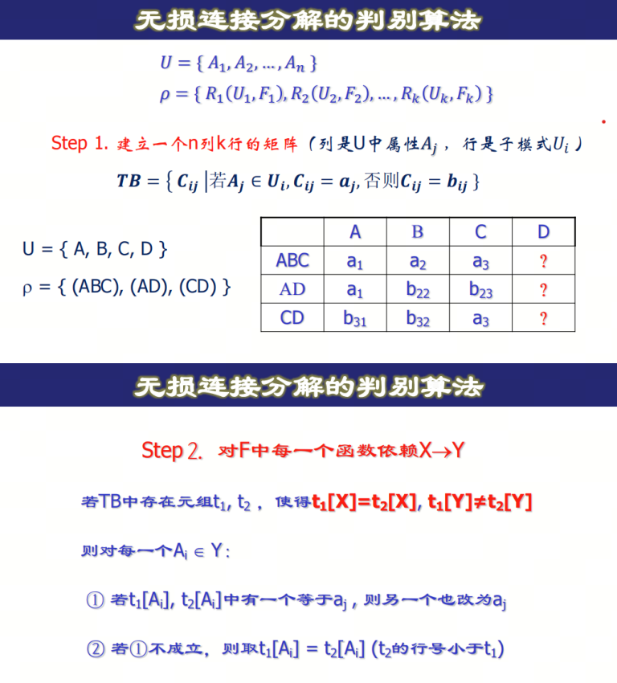
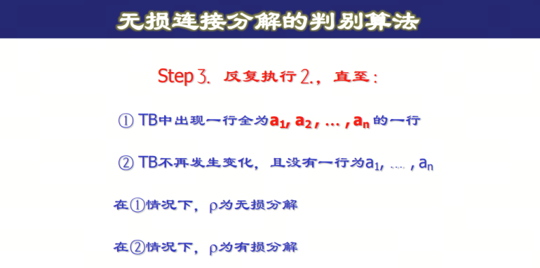
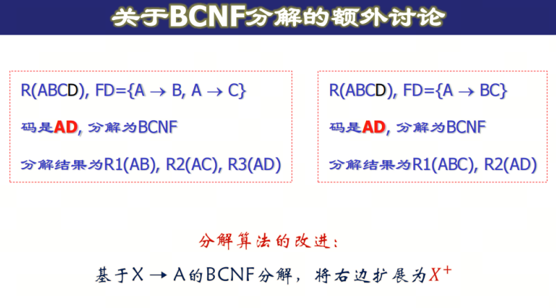

# 关系规范化-3
---

## 函数依赖在属性集上的投影

函数依赖集F在属性集U上的投影定义为：

\[ Fi = \{X \to Y|X \to Y \in F^+\land XY \subseteq Ui\} \]

### 算法

1. 先求出 $Ui$ 中每个属性组合关于 $F$ 的闭包  
2. 然后留下闭包导出的函数依赖中左部属性和右部属性都在 $Ui$ 中的部分  

如 $F = \{A \to B, B \to C, C \to D\}$ 在 $S(ACD)$ 上的投影为：$\{A \to C, A \to D, C \to D\}$

## 模式分解

关系模式 $R(U, F)$ 的一个分解是指  

\[ \rho = \{R1(U1, F1), R2(U2, F2), \ldots, Rn(Un, Fn)\} \]  

其中 $U = \bigcup_{i=1}^n U_i$ 并且没有 $U_i \subseteq Uj$ ，$Fi$ 是 $F$ 在 $U$ 上的投影。

### 模式分解的目标

- 消除异常：达到更高级范式，即尽量避免各种更新异常或者冗余数据  
- 信息保真：无损连接分解，即分解后的表进行连接后不会出现多余的行  
- 避免违约：保持函数依赖  

### 保持函数依赖

设关系模式 $R(U, F)$ 的一个分解是  

\[ \rho = \{R1(U1, F1), R2(U2, F2), \ldots, Rn(Un, Fn)\} \]  

如果 $F^+ = (\bigcup_{i=1}^n F_i)^+$ 则称 $\rho$ 是保持函数依赖的分解  

1. 如何判断分解是保持函数依赖的？  
   - 保持函数依赖 $\Leftrightarrow F^+ = (\bigcup_{i=1}^n F_i)^+ \Leftrightarrow F \subseteq (\bigcup_{i=1}^n F_i) \land F_i \subseteq F^+$

### 保持无损连接分解

设关系模式 $R(U, F)$ 的一个分解是  

\[ \rho = \{R1(U1, F1), R2(U2, F2), \ldots, Rn(Un, Fn)\} \]  

- $r$ 是 $R$ 的任意一个关系实例，定义 $m_\rho(r) = \infty \prod_{U_i}(r)$ 若 $m_\rho(r) = r$，称 $\rho$ 是 $R$ 的一个无损分解  

1. 如何判断分解是无损连接分解的？

    
    

    核心思想：填 a 表示该属性组可以完全决定这个属性，一行全部为 a 则表示该行可以完全决定该关系，自然不会出现多余的行。  

2. 分解为两个关系模式的无损分解判定算法  
关系模式R(U)的分解 $p = (U1, U2)$ 是无损连接分解 $\Leftrightarrow U1 \cap U2 \to\to \neg U1 \to U2$（或 $U1 \cap U2 \to\to \neg U2 \to U1$）  

## 模式分解算法  

1. 达到BCNF无损连接分解算法：  
给定关系模式 $R(U, F)$  
   i. 令 $\rho = R(U, F)$  
   ii. 检查 $\rho$ 中各关系模式是否属于BCNF，若是，则算法终止  
   iii. 设 $\rho \in R(U1, F1)$ 不属于BCNF，则存在函数依赖 $X \to A \in F_i^+$，且 $X$ 不是 $R_i$ 的码。将 $R_i$ 分解为 $\sigma = (S1(U1), S2(U2))$，其中 $U1 = XA, U2 = U_i - A$。以 $\sigma$ 代替 $R_i$，返回到2。  

- 达到BCNF吗？  
  - 达到BCNF  

- 保持无损吗？  
  - 不一定保持函数依赖  
  - 保持无损连接：每一步分解都是将 U 分解为 $XA$ 和 $U-A$，由分解成两个关系模式的无损连接判断算法：  
  \[ X = XA \cap U-A \to A = (XA - (U-A)) \]，所以这种分解必然是无损的。

2. 达到4NF无损连接分解算法
    给定关系模式$R(U, F)$
    1. 令$\rho = R(U, F)$
    2. 检查中各关系模式是否属于4NF，若是，则算法终止
    3. 设$\rho$中$R(U_1, F_1)$不属于4NF，则存在非平凡多值依赖$X \to\to A$, 且$X$不是$R$的码。将$R$分解为$\sigma = \{S1(U1), S2(U2)\}$, 其中$U1 = XA, U2 = Ui - A$, 以$\sigma$代替$R_i$, 返回到2.

    - 保持无损吗？
        - 保持无损连接
        - 不一定保持函数依赖

3. 达到3NF保持函数依赖的分解
    1. 求$F$的最小覆盖$Fmin$
    2. 找出不在$Fmin$中出现的属性，将它们构成一个关系模式，并从$U$中去掉它们(剩余属性仍记为$U$) 
    3. 若有$X \rightarrow A \in Fmin$, 且$XA = U, \rho = R$, 算法终止（为什么？）
    4. 对$Fmin$按具有相同左部的原则进行分组（设为k组），每一组函数依赖所涉及的属性全体为$U_i$, 令$F_i$为$F_{min}$在$U_i$上的投影，则$\rho = \{R1(U1, F1), R2(U2, F2), \ldots, Rk(Uk, Fk)\}$是$R(U, F)$的一个保持函数依赖的分解，并且每个$R(i, F) \in 3NF$。

    NOTE: 若要求分解保持函数依赖，那么分解后的模式总可以达到3NF，但不一定能达到BCNF。

4. 同时保持函数依赖和无损连接的分解算法
设$\rho = \{R1(U1, F1), R2(U2, F2), \ldots, Rk(Uk, Fk)\}$是$R(U, F)$的一个保持函数依赖的3NF分解。设$X$是$R(U, F)$的码，若有某个$U_i, X \subseteq U_i$, 则 $\rho$ 即为所求。否则令$\tau = \rho \cup R^*(X, F_X)$, $\tau$即为所求。事实上，码能够完全决定一行，因此将码单独存表后再连接时不可能出现多余的行。

## 模式调优

模式分解是为了消除异常，模式调优是为了平衡性能。
- 分解通常使得对复杂查询的回答的效率更差，因为在查询求值期间必须执行额外的连接
- 分解使得对简单查询的回答更有效，因为这种查询通常涉及相同关系的一小部分属性
- 分解通常使得简单的更新事务更有效
- 分解能降低存储空间的要求，因为它一般能消除冗余数据
- 如果冗余级别低，则分解会增加存储的需求

模式分解的常用操作

1. 反规范化：合并关系模式，减少连接操作
2. 添加冗余列：比如将另外一张表中的某些列复制到本表中，以便在查询时能同时使用，减少连接操作
3. 派生列，减少重复计算。比如存储员工平均工资
4. 垂直划分：按列内属性划分，保持紧密访问的属性在一起，提高 IO 吞吐量
