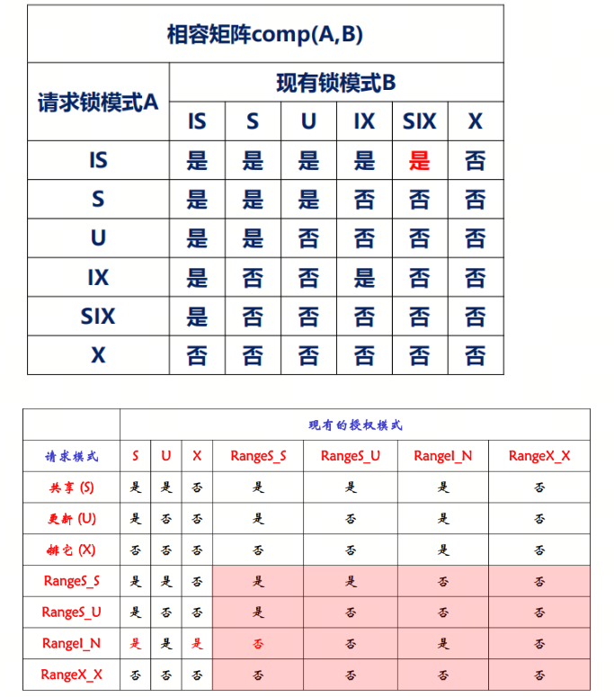

# 并发控制
---

## 封锁

- 封锁就是一个事务对某个数据对象加锁，取得对它一定的控制，限制其它事务对该数据对象使用
- 要访问数据项 \( R \)，事务 \( T \) 必须先申请对 \( R \) 的封锁，如果 \( R \) 已经被事务 \( T \) 加了不相容的锁，则 \( T \) 需要等待，直至 \( T \) 释放它的封锁

## 锁持有期

- 长锁：保持到事务结束时才释放的锁
- 短锁：在事务中途就可以释放的锁
- read uncommitted: 不申请锁
- read committed: 短 S 锁
- repeatable read: 长 S 锁

## 两阶段封锁协议 (Two-Phase Locking Protocol)

- 增长阶段(Growing Phase): 事务可以获得锁，但不能释放锁
- 缩减阶段(Shrinking Phase): 事务可以释放锁，但不能获得锁
- 封锁点: 事务获得最后封锁的时间点，之后不会再申请锁
- 若一组事务均服从两阶段封锁协议，则它们的调度一定是可串行化的，且事务调度等价于和其封锁点顺序一致的串行调度
  - 证明：令 \(\{T0, T1, ..., Tn\}\) 是参与调度的事务集。如果 \( T \) 对数据项 \( R \) 加 \( A \) 型锁，\( T \) 对 \( R \) 加 \( B \) 型锁，且 \( comp(A, B) = false \)，即 \( A, B \) 不相容，若 \( Ti \) 先获得锁，则 \( Ti \) 先于 \( Tj \)，记作 \( Ti \rightarrow Tj \)，得到一个优先图。设 \( t \) 是 \( T \) 的封锁点，若 \( Ti \rightarrow Tj \)，则 \( ti < tj \)，因为 \( Tj \) 只能在 \( Ti \) 释放锁后才能拿到所有的锁，即封锁点一定处在 \( Ti \) 释放锁的时间，也即 \( ti < tj \)。若 \(\{T0, T1, ..., Tn\}\) 不可串行化，则在优先图中存在环，不妨设为 \( T0 \rightarrow T1 \rightarrow ... \rightarrow Tn \rightarrow T0 \)，则 \( t0 < t1 < ... < tn < t0 \)，矛盾。结论：事务环路推出时间上的封锁点环路，这是不可能的。

## 封锁类型

- 排它锁（X锁，eXclusive lock）
  - lock-X(R)：又称写锁，持有X锁可以读写数据项
  - 事务T对数据对象R加上X锁，则其它事务对R的任何封锁请求都不能成功，直至T释放R上的X锁

- 共享锁（S锁，Share lock）
  - lock-S(R)：又称读锁，持有S锁只能读取数据项
  - 事务T对数据对象R加上S锁，则其它事务对R的X锁请求不能成功，而对R的S锁请求可以成功

- 更新锁（U锁，Update lock）
  - 当一个事务查询数据以便将来要进行修改时，可以对数据项施加更新锁（U锁：先读后写）
  - 如果事务修改资源，需将更新锁转换为排它锁
  - 一次只有一个事务可以获得资源上的更新锁

- 意向锁（I锁，Intention Lock）
  - 在分层封锁中，封锁了上层节点就意味着封锁了所有内层节点。如果有事务T1对某元组加了S锁，而事务T2对该元组所在的关系加了X锁，实则隐含地X封锁了该元组，从而造成矛盾
  - 措施：引入意向锁（Intend）。当为某节点加上I锁，表明其某些内层节点已发生事实上的封锁，防止其它事务再去显式封锁该节点
  - 过程：从封锁层次的根开始实施I锁，依次占据路径上的所有节点，直至要真正进行显式封锁的节点的父节点为止

- IS锁：对一个数据对象加IS锁，表示它的后裔节点拟（意向）加IS锁
- IX锁：对一个数据对象加IX锁，表示它的后裔节点拟（意向）加X锁
- SIX锁：共享与意向排他锁。在表上对表加SIX锁，则表示该事务要读整个表（S锁），同时会更新个别元组（IX锁）。

- 码范围锁：
  - 码范围锁是为了解决区间封锁中的幻像并发问题而引入的
  - 码范围锁通过覆盖索引行和索引行之间的范围来工作，因为第二个事务在该范围内进行任何行插入、更新或删除操作时均需要修改索引，而码范围锁覆盖了索引项，所以在第一个事务完成之前会阻塞第二个事务的进行

- 码范围锁出现的条件：在该数据项上存在索引，并且隔离性级别是 serializable

#### 码范围锁模式(SQL Server)

##### 码范围锁包括范围组件和行组件，前者表示保护两个连续索引项之间范围的锁模式(RangeT)，后者表示保护索引项的锁模式(K)，这两部分用下划线连接，如RangeT_K

| 范围    | 行    | 模式    | 描述    |
|---|---|---|---|
| RangeS   | S    | RangeS_S    | 共享范围，共享资源锁；可串行范围扫描 |
| RangeS   | U    | RangeS_U    | 共享范围，更新资源锁；可串行更新扫描 |
| RangeI   | NULL  | RangeI_N    | 插入范围，空资源锁；用于在索引中插入新码之前测试范围 |
| RangeX   | X    | RangeX_X    | 排它范围，排它资源锁；用于更新范围中的码 |

**NOTE:** Range_I_N 和 Range_S_S 互斥，由此保证不会发生幻象。

## 带锁转换的两段锁协议

1. 增长阶段
    • 可获得 lock-S 和 lock-X 锁
    • 可以将 lock-S 升级成 lock-X

2. 缩减阶段
    • 释放 lock-S 和 lock-X 锁
    • 可将 lock-X 锁降级成 lock-S

Q1: 升级锁和重新申请锁有什么区别？
A1: 先释放锁再申请锁会需要重新排队，事件开销比较大，而升级锁不需要重新排队。

Q2: 在哪个隔离性级别下会出现锁转换？
A2: 在 repeatable read 下，会出现锁转换。

3. 锁转换带来的问题
    • 会出现转换死锁，比如两个事务都先读后写。
    • 解决办法：区分只读事务（加S锁）和先读后写事务（加U锁）

Q3: U 锁？
A3: U 锁并不是 update 语句才用到的锁，先读后写的事务都要申请 U 锁。update 语句本身也是先读后写的（先找出所有要修改的项，然后一起加锁）。U 锁其实是读锁，当持 U 锁的事务要修改数据时，需要将 U 锁转换为 X 锁，所以 U 锁和 S 锁是不互斥的。

## 封锁粒度

封锁对象：属性值、元组、关系、数据库、索引项、索引、物理页、块

封锁粒度大小的权衡因素
- 封锁粒度大：锁的数目少，开销小；冲突几率大，并发度低
- 封锁粒度小：锁的数目多，开销大；冲突几率小，并发度高
- 事务的完整性相关域：只封锁与操作有关的的数据对象

为了提高查询的效率，系统需要支持多粒度锁。但是可能会发生不同力度的锁之间的隐含冲突。比如一个事务加行锁（把表名和id送到锁管理器），另外一个事务要加表锁（直接把表名送到锁管理器），由于名字不一样，锁管理器检测不出冲突。
- 解决方法：意向锁

Q4: I 锁？
I 锁是一种宽泛的通知，I 锁和 I 锁相互不冲突，但是 I 锁和其他实际锁都冲突。因此 I 锁效率很低，需要进一步细化。

## 锁互斥

## 特殊锁模式

- latch(闩锁)：保护内存页，相比于保护逻辑对象的锁，latch 开销更小。
- 自增锁

## 封锁带来的问题

### 阻塞

比如两个事务在 update 同一个表中的不同条目。第一个事务扫描全表，然后在要修改的条目上加 X 锁，第二个事务扫描全表，此时需要加 S 锁。由于第一个事务持有 X 锁，第二个事务只能等待。

### 死锁

死锁发生的条件：

1. 互斥条件：事务请求对资源的独占控制  
2. 占有等待条件：事务已持有一定资源，又去申请并等待其它资源  
3. 非抢占条件：直到资源被持有它的事务释放之前，不能将该资源强制从持有它的事务夺去  
4. 循环等待条件：存在事务相互等待的等待圈  

**定理**：在条件 \(1, 2, 3\) 成立的前提下，条件 \(4\) 是死锁存在的充分必要条件。

### 预防死锁

只需要破坏死锁发生条件中的一条即可。

1. 破坏占有等待条件  
   i. 预先占据所需的全部资源，要么一次全部封锁，要么全部不封锁。  
   ii. 所有资源预先排序，事务按规定顺序封锁数据。比如规定必需按照 R1, R2, R3 的顺序申请锁，则 R1 锁定后，R2 不能申请，R3 也不能申请。

2. 破坏非抢占条件  
   i. wait-die: 当新事物要等待老事务的时候，回滚新事物  
   ii. wound-wait: 当老事务要等待新事物的时候，回滚新事物  

### 死锁检测和恢复

1. 死锁检测：构造事务之间的等待图，检测是否存在环路。  
2. 死锁恢复：  
    - 如果等待封锁的时间超过限时，则撤销该事务  
    - 如果在等待图中出现环路，则回滚一个事务，直到死锁解除。

### 活锁

可能存在某个事务永远处于等待状态，得不到执行，称之为活锁（饿死）。活锁的例子：身处众多读锁中的写锁。

避免活锁的策略是遵从“先来先服务”的原则，按请求封锁的顺序对各事务排队。这样可能会牺牲一定的并发性能，但是可以规避活锁的发生。