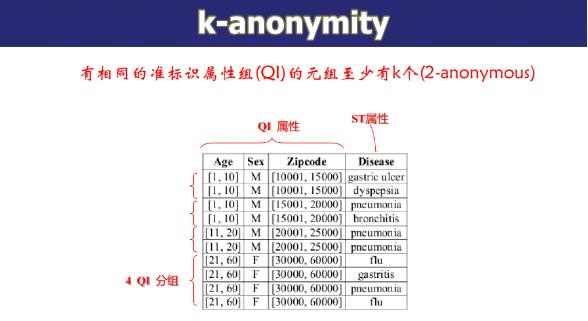

# 数据库安全性
---

## 主体

主体(principal)是可以授予权限以访问特定数据库对象的对象包括登录用户、角色、应用程序。

## 客体

各个受保护的对象

- 服务器范围 登录名、数据库和端点
- 数据库范围 数据库用户、角色、架构
- 架构范围
  - 各种对象，如表、视图、
  - 函数、存储过程等

## 权限

- 权限(permission)：允许主体在安全对象上执行操作
- 权限的转授和回收：允许用户把已获得的权限转授给其他用户，或者把已授给其他用户的权限再回收上来

**权限图：** 结点是用户，根结点是DBA

- 有向边Ui → Uj, 表示用户Ui把某权限授给用户Uj
- 一个用户拥有权限的充分必要条件是在权限图中有一条从根结点到该用户结点的路径

## 角色

角色是一组相关权限的结合，即将多个不同的权限集合在一起就形成了角色。创建角色之后，就不再需要为每个用户单独分配权限，而是为用户分配角色。角色可以被授予给用户，也可以从用户中回收。

## 访问控制类型

1. 自主访问控制（DAC）
    - 对客体拥有控制权的主体能够将对该客体的访问权自主地授予其它主体，并在随后任何时刻将这些权限回收
2. 强制访问控制（MAC）
    - 敏感度标记：绝密、机密、可信、公开
    - 主体：许可级别；客体：密级
3. 保密性规则
    - 下表：仅当主体许可证级别高于或等于客体密级时才能读取相应客体
    - 上写：仅当主体许可证级别低于或等于客体密级时体才能写相应客体

## 审计

- 审计就是对指定用户在数据库中的操作情况进行监控和记录，用以审查用户的相关活动
  - 如数据被非授权用户删除，用户越权管理，权限管理不正确，用户获得不应有的系统权限等
- 审计就是监视和收集指定数据库的活动数据
  - 如哪些表经常被修改，用户共执行了多少次I/O操作等，为优化提供依据

## 加密

有些数据不希望 DBA 看到，因此需要对敏感数据进行加密。常见的加密算法有：

- 对称密钥加密：DES
- 非对称密钥加密：RSA

## SQL注入

比如在输入密码时，攻击者可以输入：

    ' or 1=1 -- 

这样就绕过了密码验证，直接登录成功。

## 统计数据库安全

要求：用户只能查询数据的聚集值，不能访问个体

漏洞一：个体太少
- 查询选修“古典哲学史”的学生的平均成绩

漏洞二：多次查询，太多交叠
- Q1：查询n个学生的总成绩为x
- Q2: 查询n个学生+A的总成绩为y，推出A的总成绩为y-x

防范措施：
1. 查询引用的数据不能少于 \( n \)
2. 两个查询的交不能多于 \( m \)
3. 推出个体信息至少需要 \( 1 + \frac{n-2}{m} \) 次查询

## 隐私保护

- 有一些信息可以从多张表的连接中间接推断
- 防范措施

