# 数据库中的非关系数据
---

数据库的数据类型决定了数据库能管理的数据模式的范围。因此我们可以通过把数据类型从 int, str 等基本类型扩展到更复杂的类型，比如 xml, json, vector 等来提高数据库的管理能力。

## 处理树形结构数据或图形结构数据

#### 存储邻接表
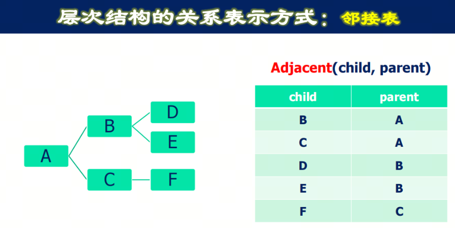

#### 存储物化路径
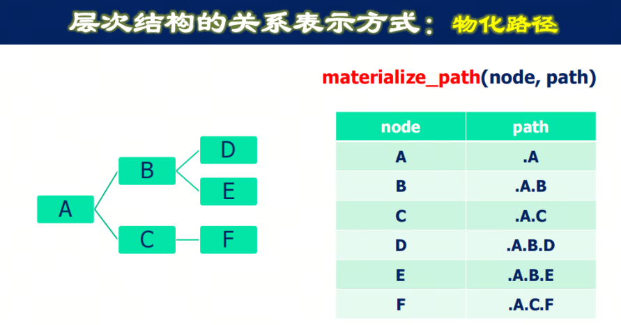

#### 存储嵌套集合
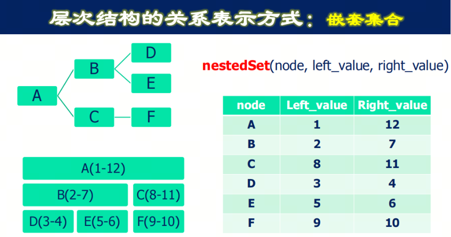

#### 查询方式 -- 递归查询
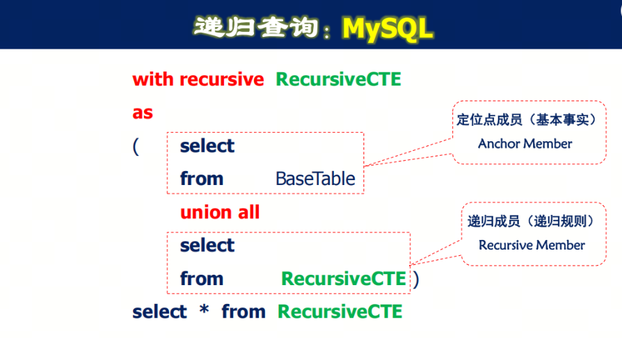

## 处理半结构化数据

### XML

#### XML 和 HTML 的区别
1. HTML 解决的是网⻚显示格式的问题
2. XML jieba 解决的是内容存储的问题

#### XML 的应用场景
1. 数据交换与共享：比如不同公司间制定同一套数据传输标准来适应不同公司内部的数据存储方式。（公司内部可以直接应用数据库进行更高效率的查询。）
2. XML 比起关系表占用的存储资源更多。但是能解决半结构化数据存储时无法用同一的关系模式存储或者用同一关系模式存储表结构相当稀疏的问题。

#### XML 文档产生规则：DTD
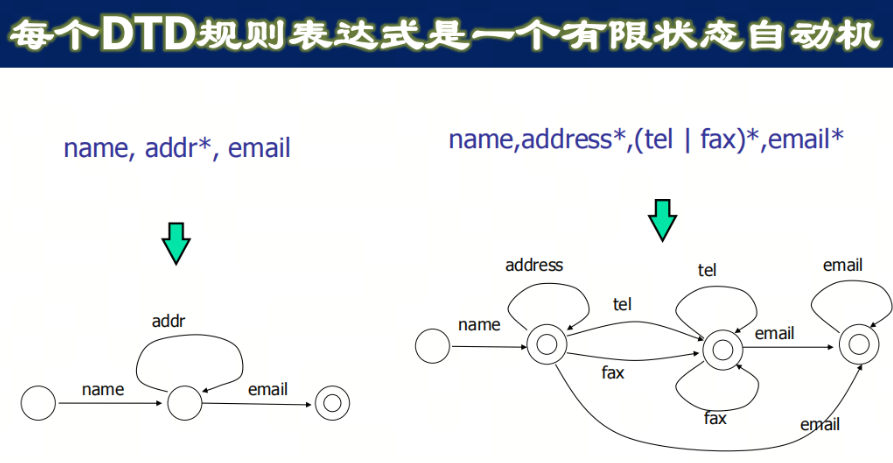

#### XML 的操作
1. 数据结构：树状结构 DOM
    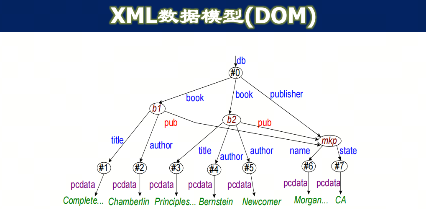
2. 路径查询：XPath
    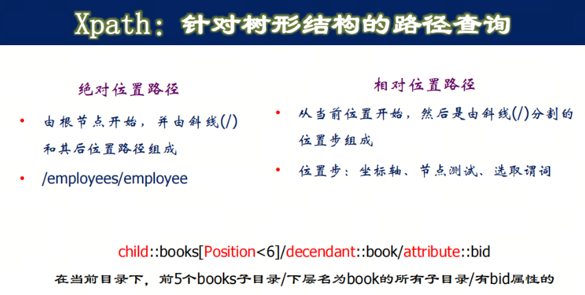

### JSON
XML标签占用的存储和传输资源较大, 而JSON是一种轻量级的数据交换格式，易于人们阅读和编写，同时也易于机器解析和生成。JSON 也适合处理半结构化数据。

#### MySQL 中生成 JSON 的函数
1. json_array (val [, val ]...) 将值列表返回为JSON数组
2. json_object ( key, val [, key, val ]... ) 将键值对列表返回为JSON对象

#### JSON 的操作
1. JSON 的检索
    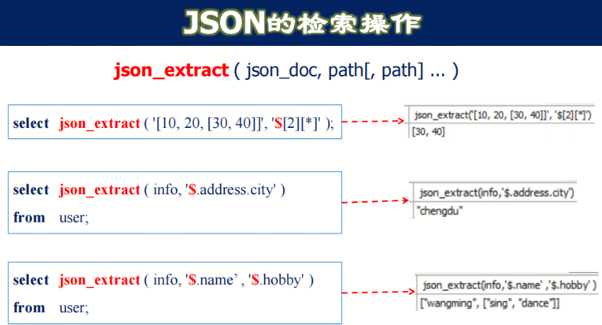
2. JSON 与表的转化
    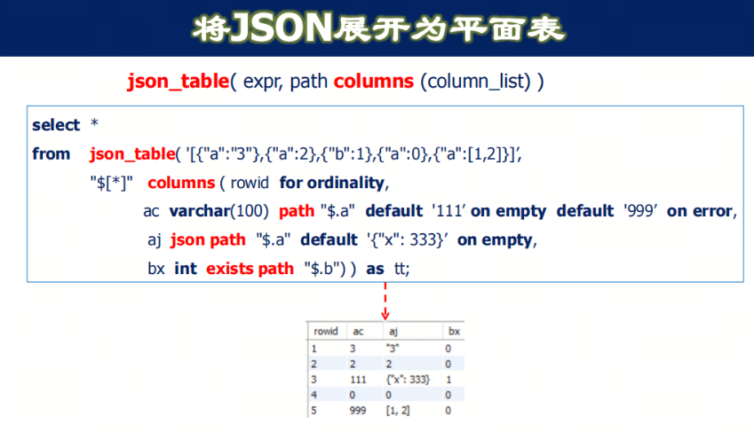
    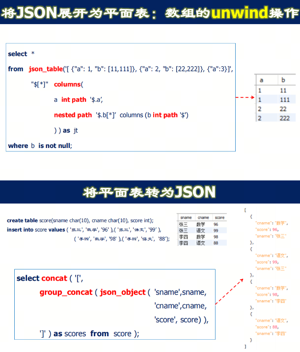

## 处理非结构化数据（文字，图像，音频）-- 向量
通过词嵌入(embedding)来更好的处理数据的语义信息。非结构化数据(文本、图像和音频)缺乏预定义的格式，为了利用这些数据，我们需要使用嵌入将其转换为数字表示。
- 嵌入就是每一个项（一个词，图像，或其他东西）一个独特的高维数字表示，捕捉其意义或本质
- 嵌入作为一个桥梁，将非数字数据转换为机器学习模型可以使用的形式，使它们能够更有效地识别数据中的模式和关系

### 向量数据库中的核心问题 -- 向量的相似度匹配
1. 多维索引：k-d tree
    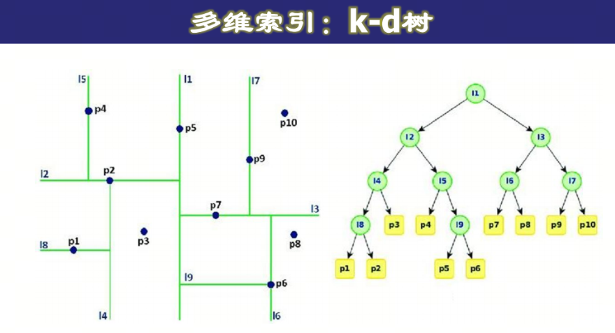

2. 近似最近邻搜索算法：ANNOY
    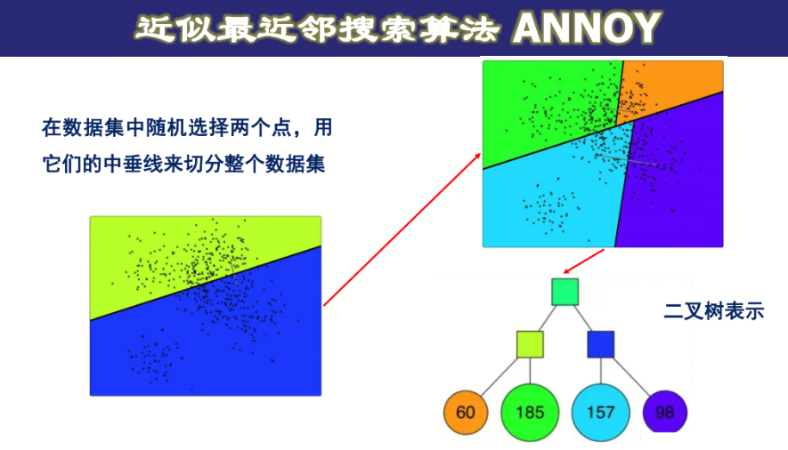
    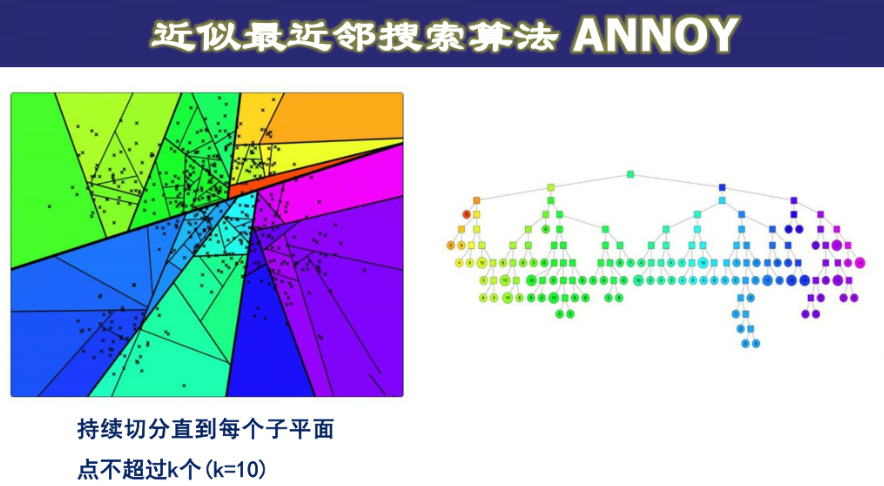

3. HNSW: Hierarchical Navigable Small World
    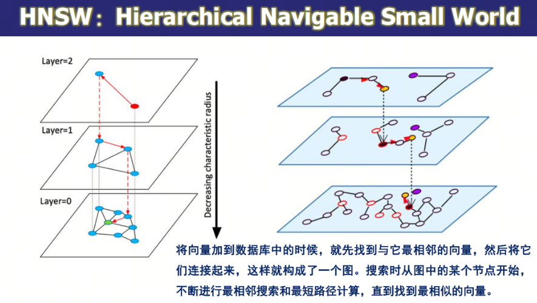