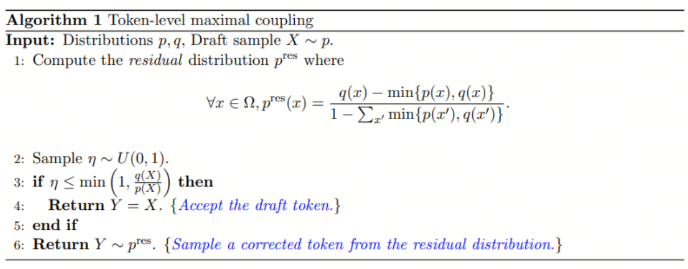
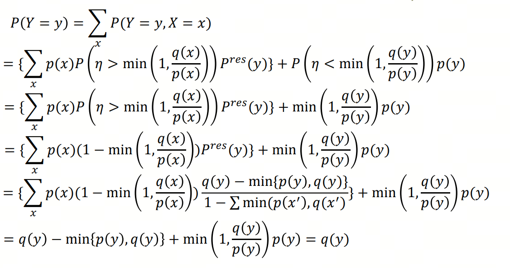

## Lossless Acceleration

### Speculative Decoding

Basic Ideas: Let small language model generate a draft and let a large model revise it.

1. Draft construction:
    - Given previous context $s = (x_1, \ldots, x_t)$
    - Generate the following draft sequence: $(\tilde{x}_{t+1}, \ldots, \tilde{x}_{t+m})$
    - This process can be done using a small language model with low computational cost.

2. Draft verification:
    - Feed the sentence $s' = (x_1, \ldots, x_t, \tilde{x}_{t+1}, \ldots, \tilde{x}_{t+m})$ to a large model with a single pass.
    - The LLM will give the probabilities of each toke in $(\tilde{x}_{t+1}, \ldots, \tilde{x}_{t+m})$ simultaneously.
    - Discard the tokens starts from the first wrong token that the small LM predicts.
    - Remain the tokens that LLM has the same prediction as the small model.
    - Feed the revised sentence to the small LM and loop back.

The main question in this process is how to guarantee that sentences generated in this manner has the same distribution as the sentences generated by the LLM?

- Abstract this problem as: given two distributions $p(x)$ and $q(x)$, can we sample data from $p(x)$ but required the sample follows $q(x)$?

- Use the following algorithm: 

- Prove: 

## Lossy Acceleration

### Pruning

Used in Transformers, not really popular and can not provide significant speedup.

Two basic ideas:
- Structured pruning(pruning synapses): set the weights between layers that are close to zero to zero, then fine-tune the model.
    - This pruning won't lead to acceleration, but also won't cause too much performance degradation. Maybe it is more suitable as a regularization technique to prevent overfitting.

- Unstructured pruning(pruning neurons): remove all weights connected to a neuron to zero, then fine-tune the model.
    - This pruning can lead to acceleration(not too much), but also cause performance degradation.
    - usage cases: remove the "heads" in transformers.

### Quantization

Used in language models, very popular, very pragmatic, but hard to implement.

Quantization can be made to:
- weights: this is the common practice
- gradients: this make parallel training faster, because the data transferd between GPUs is smaller.
- activation function: this makes inference faster

Several problems with quantization:
- Need significant engineering efforts:
    - maybe need customize cuda functions to support low precision data operations
- Hard finetuning

### Knowledge Distillation

Popular for diffusion models and language models.

The basic idea is to train a small model to predict the output of a large model, also monitor the result:

- loss = $loss(g_\theta(x), f(x)) + \alpha loss(g_\theta(x), y)$, where $g_\theta$ is the small model, $f$ is the large model, $\alpha$ is the coefficient, and $y$ is the ground truth.
