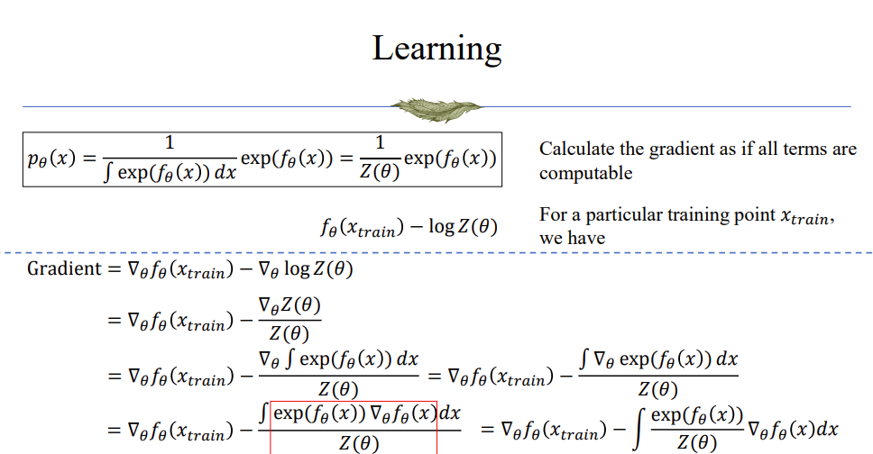
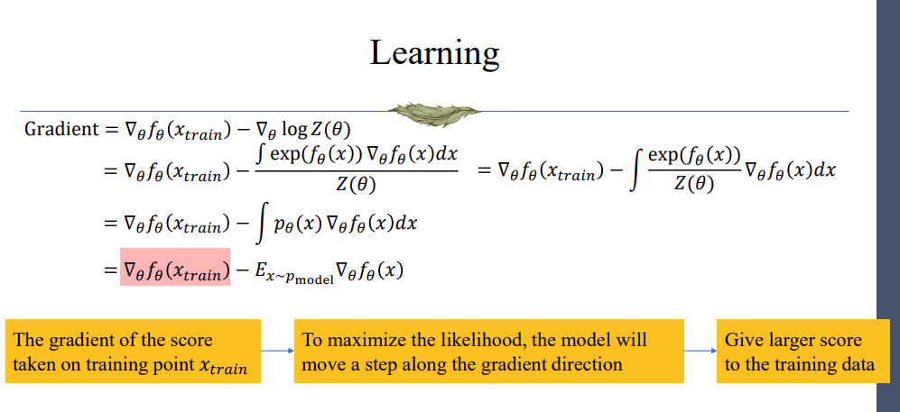
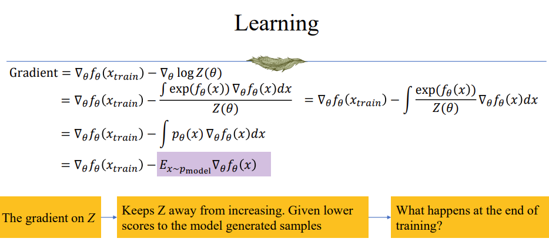
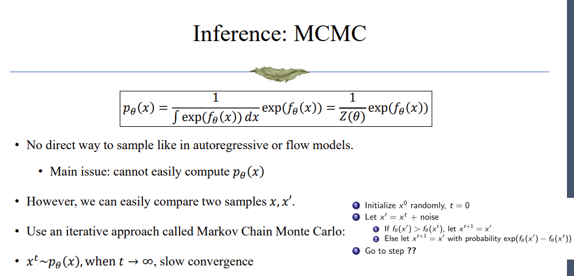
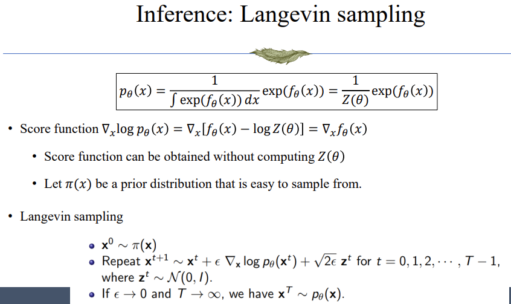

### Overview
Energy-based model directly models the probability distribution of data. Current practice of energy-based model cannot achieve satisfying result.

### Energy-based model in physics
- Energy-based model originates in statistical physics:
    - Assume $x$ is the state of a system(e.g., thermodynamic)
    - How likely will $x$ appear (through the time)?

        ```math
        \begin{align*} 
            p(x) & = \frac{1}{Z}\exp (-\frac{E(x)}{T}) \\
            Z & = \int \exp(-\frac{E(x)}{T})dx
        \end{align*} 
        ```

    - So $p(x)$ is high when the energy $E(x)$ is low; $p(x)$ is sharp when temperatre $T$ is low.

### From physics modeling to generative modeling
- $x$ is an image(or a text/audio)
- Replace the "energy" by a parametric model $f_\theta(x)$, like neural networks
- $f_\theta(x)$ captures the "correctness" of $x$ and output an unbounded score
- Energy-based model can be considered as a "softmax" prediction by considering each $x$ as a category: 

    ```math
    Pr(c) = \frac{1}{Z}\exp(f(c)) = \frac{\exp(f(c))}{\sum_{c}\exp(f(c))} 
    ```

### Why energy-based model?
- For all generative models, we are trying to model the probability distribution of the data
    - This can be done in different ways:
        1. Directly model the distribution: like autoregressive models, or flow-based models, they can directly output the possibility of each pixel/word/frame
        2. Indirectly model the distribution, model the parameters of the distribution: like VAE, encoder extracts the latent code(which can be deemed as the parameters of the distribution) and decoder samples the data using those parameters.
        3. Indirectly model the distribution, directly model the sampling process. In these methods, models try to learn the mapping from noise to dat. The main regard of these models is whether the sampled data comes from the target distribution:
            - GAN: don't have encoder, use distance between distribution as loss
            - Diffusion models: use reconstruction as loss(the reconstruction in diffusion doesn't apply to the input and output, but also apply to every intermediate state)

- Now for energy-based model, we are trying to directly model the distribution of the data(giving out the possibility of each data point).

- Requirements to model a standard probability distribution (autoregressive, flow-based...)
    - $p(x) \gt 0$
    - Sum-to-one requirement: $\sum_{x}p(x) = 1$
        - It is not easy to find sum-to-one function classes
        - Efforts can be made to compute the "sum" of the function, but it is usually hard to analytically compute the "sum"(because we cannot sample all possible values of $x$)

- Luckily, energy-based model is a way to deal with the case where the function is complex and the sum is not tractable.

### Main ideas for energy-based model

Recap the energy-based model:

```math
p(x) = \frac{1}{\int \exp(f_\theta(x))dx}\exp (f_\theta(x))
```

**Q1:** why exponential function?

- Capture very large variations in probability(sharp distributions)
- Exponential families. Many common distributions can be written in this form.
- Motivated from statistical physics, $-f_\theta(x)$ is the energy

Now our target is to get rid of computing the sum. One good attribute of energy-based model is that it's easy to compare which data point has higher probability(even if we don't know the exact number of their probabilities):

```math
\begin{align*}
    & p_\theta(x) \gt p_\theta(x') \\
    \Leftrightarrow & \frac{1}{Z(\theta)}\exp(f_\theta(x)) \gt \frac{1}{Z(\theta)}\exp(f_\theta(x')) \\
    \Leftrightarrow & \exp(f_\theta(x)) \gt \exp(f_\theta(x')) \\
    \Leftrightarrow & f_\theta(x) \gt f_\theta(x')
\end{align*}
```

##### An application of this comparison attrivute
- Ensemble of experts
    - Suppose you have trained several models $q_{\theta _1}(x), r_{\theta _2}(x), s_{\theta _3}(x)$. They can be different models
- Each one is like an expert that can be used to score how likely an input $x$ is.
- Assuming the experts make their judgments independently, we can ensemble them as:

    ```math
    q_{\theta _1}(x) \cdot r_{\theta _2}(x) \cdot s_{\theta _3}(x) \\
    p_{\theta _1,\theta _2,\theta _3}(x) = \frac{1}{Z(\theta _1,\theta _2,\theta _3)}q_{\theta _1}(x) \cdot r_{\theta _2}(x) \cdot s_{\theta _3}(x)
    ```

##### Training Method
1. training intuition: maximize the likelihood on the training data
    - likelihood of training data:
        ```math
        \prod_{i=1}^n p_\theta(x_i) = \frac{1}{Z^n(\theta)}\exp(\sum_{i=1}^n f_\theta(x_i))
        ```

    - can we simply maximize the exponential term? (Just overlook the sum, and take $-\exp(\sum_{x\in Train}f_\theta(x))$ as the loss)
        - No. Moving $f_\theta(x)\rightarrow 2f_\theta(x)$ will decrease the loss, but doesn't change the probability of $p_\theta(x)$

    - the idea is increase $f_\theta(x_{train})$ and decrease $Z(\theta)$
    
    
    

    - At the end, the probability of each training data point is higher, but the whole sum is lower, which means other data points that does not appear in the training set are assigned lower probability.

    - now

        ```math
        \begin{align*}
            Gradient & = \nabla _\theta f_\theta(x_{train}) - E_{x\sim p_{model}}[\nabla _\theta f_\theta(x)] \\
            Gradient & \approx \nabla _\theta f_\theta(x_{train}) -\nabla _\theta f_\theta(x_{model})
        \end{align*}
        ```

    - How can we sample $x_{model}$ from $p_\theta(x)$?
        - This is also how we can use this model to generate new ata after is trained.

##### Sampling Method

What we have: a model that can compare the probability of different data points.

What we can do: iteratively generate a data that has higher probability than the current one.

1. MCMC


2. Langevin Sampling


**NOTE:** The randomness added in MCMC and Langevin Sampling can make sure the output is really sampled from the target distribution instead of stucking at the data with highest probability.


