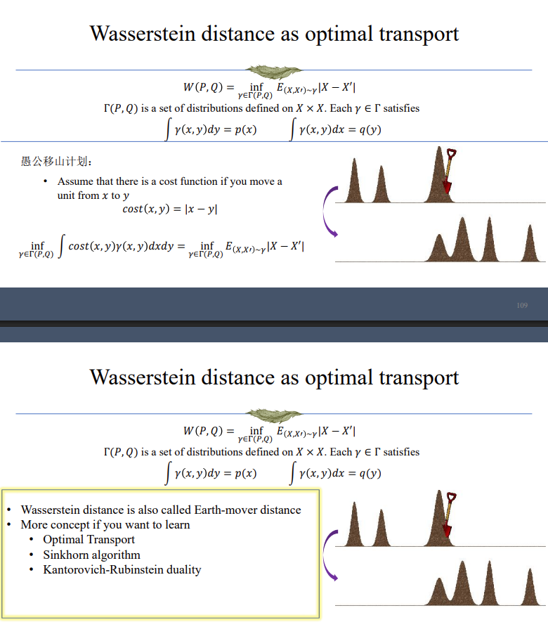
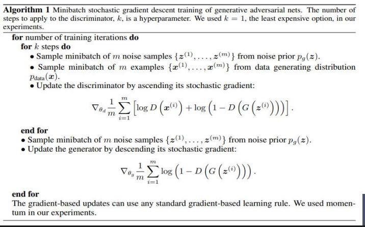
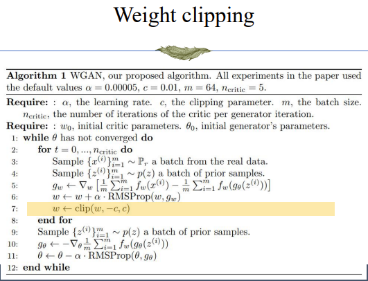

## From simple distributions to complex distributions
- Problem: For a random variable $X$ follows a complex distribution $Q$, how can we generate data from $Q$?

- Assume we have the cumulative probability function of $Q$, which is $F(x)$. $F(x)$, as a cumulative density funciton, has the following properties:
    1. $F(x)$ is non-decreasing
    2. $\lim_{x\to-\infty}F(x)=0$ and $\lim_{x\to\infty}F(x)=1$
    3. $F(x)$ is right continuous, i.e. $\lim_{y|x}F(y)=F(x)$

- Assume we have the inverse of $F(x)$, which is $F^{-1}(x)$

- Algorithm
    - Sample $Z$ from a uniform distribution
    - $X = F^{-1}(Z)$ follows $Q$

- Proof

```math
P(X\lt t) = P(F^{-1}(Z)\lt t) = P(Z\lt F(t)) = F(t)
```

- Conclusion: Samples from any complex distributions can be generated from simple distributions

## Main idea of GAN

```math
x = NeuralNetwork(z), z \sim Gaussian
```

### How to train GAN?

We now have a model that maps noise to data. We use difference between the generated data distribution and the true data distribution as the loss function.

---
#### How to measure difference between two distributions?

##### f-divregence: 
- Denote $P(X)$ as one distribution(with density $p(x)$)
- Denote $Q(X)$ as another distribution(with density $q(x)$)
- A function $f: [0, +\infty]\rightarrow [-\infty, +\infty]$
    - Convex
    - Non-negative
    - $f(1) = 0$
    - finite
- Define f-divergence as:

```math
D_f(P||Q) = \int f(\frac{dP(x)} {dQ(x)})dQ(x) = E_Q[f(P(X)/Q(X))] \\
D_f(P||Q) = \int f(\frac{p(x)} {q(x)})q(x)dx = E_{x\sim Q}[f(p(x)/q(x))]
```
- Properties of f-divergence: Non-negativity, linearity, joint convexity

- Examples:
    - when $f(t) = t\log(t)$, we have $D_f(P||Q)=\int p(x)\log\frac{p(x)}{q(x)}dx$, which is the KL-divergence
    - when $f(t) = \frac{1}{2}|t-1|$, we have $D_f(P||Q)=\frac{1}{2}\int|p(x)-q(x)|dx$, which is the total variation distance
    - when $f(t) = -(t+1)\log\frac{t+1}{2}+t\log t$, we have $D_f(P||Q)=KL(P||M)+KL(Q||M)$, where $M=\frac{1}{2}(P+Q)$, which is the Jensen-Shannon divergence

##### Integral probability metric

- Define the integral probability metric as:

    ```math
    D_F(P, Q) = \sup_{f\in F} |E_{X\sim P}[f(X)] - E_{X\sim Q}[f(X)]|
    ```

    where $F$ is a set of functions.

- Examples:
    - Wasserstein distance: $F$ is the set of all 1-Lipschitz functions

    

---

#### GAN(vanilla)

Let's use Jensen-Shannon divergence as the loss function. Then our goal is:

```math
\begin{align*}
    
Minimize & \hspace{5mm} KL(P_*||\frac{P_*+P_\theta}{2}) + KL(P_\theta||\frac{P_*+P_\theta}{2}) \\

\Leftrightarrow Minimize & \hspace{5mm} E_{x\sim P_*}[\log\frac{2P_*(x)}{P_*(x)+P_\theta(x)}] + E_{x\sim P_\theta}[\log\frac{2P_\theta(x)}{P_*(x)+P_\theta(x)}] \\

\Leftrightarrow Minimize & \hspace{5mm} E_{x\sim P_*}[\log\frac{P_*(x)}{P_*(x)+P_\theta(x)}] + E_{x\sim P_\theta}[\log\frac{P_\theta(x)}{P_*(x)+P_\theta(x)}] 

\end{align*}
```

Two basic observation is:
- We don't have access to the ground truth distribution $P_*$.
- It's usually difficult to compute general $P_\theta(NeuralNetwork(z)=x)$

So we directly let the model learns a binary classification problem:

```math
D_\theta(x) = \frac{P_*(x)}{P_*(x)+P_\theta(x)}
```

When the sample comes from $P_*$, $D_\theta(x)$ should be close to 1, and when the sample comes from $P_\theta$, $D_\theta(x)$ should be close to 0.

If we denote the generator as $G_\theta(z)$, which can generate samples from noise $z$, then we can use the following loss function:

```math
Minimize_{G_\theta}Maximize_{D_{\theta'}}\hspace{5mm} E_{x\sim P_*}[\log D_{\theta'}(x)] + E_{z\sim N(0,I)}[\log(1-D_{\theta'}(G_\theta(z)))]
```



But in reality, using this function for training is hard, especially for the generator. Because at the begining, generator cannot generate good samples, so the discriminator can easily seperate the generated samples from the real samples. And because the gradient of the discriminator is:

```math
\nabla \log(1-D_{\theta'}(G_\theta(z))) = \frac{1}{1-D_{\theta'}(G_\theta(z))} \cdot \frac{\delta D}{\delta G}\frac{\delta G_{\theta'}}{\delta \theta'}
```

the term $\frac{\delta D}{\delta G}$ is close to 0, so the generator can hardly make progress. So we adjust the optimizing of generator from minimizing

```math
E_{z\sim N(0,I)}[\log(1-D_{\theta'}(G_\theta(z)))]
```

to maximizing

```math
E_{z\sim N(0,I)}[\log D_{\theta'}(G_\theta(z))]
```

then the gradient of the generator is:

```math
\nabla \log(D_{\theta'}(G_\theta(z))) = \frac{1}{D_{\theta'}(G_\theta(z))} \cdot \frac{\delta D}{\delta G}\frac{\delta G_{\theta'}}{\delta \theta'}
```

because term $\frac{1}{D_{\theta'}(G_\theta(z))}$ is large at the begining, so the generator can make progress.

#### WGAN

Let's use Wasserstein distance as the loss function. The main idea is that we use a neural network to model all 1-Lipschitz functions(using tricks like gradient penalty to enforce the Lipschitz constraint). And we optimize the network so that it maximize the distance between the generated distribution and the true distribution, and optimize the generator so that it minimize the distance.

```math
\begin{align*}
W(P, Q) = & \sup_{f\in F} |E_{X\sim P}[f(X)] - E_{X\sim Q}[f(X)]| \\
         & \text{where } F \text{ is a set of 1-Lipschitz functions} \\
\Rightarrow W(P, Q) = & \sup_{\theta'}E_{x\sim P_*}[f_{\theta'}(x)] - E_{z\sim N(0,I)}[f_{\theta'}(G_\theta(z))] \\
         & \text{where } f_{\theta'} \text{ is a neural network}
\end{align*}
```

To enforce the Lipschitz constraint, we design the training process as:


But weight clipping only guarantees that the function is bounded. We know that bounded continuous function has finite Lipschitz constant, but finite does not necessarily means small. To further contrain the function group, we must guarantee that the gradient(with respect to the input) of the function has norm at most 1 everywhere. We use gradient penalty to enforce this constraint:

```math
Minimize_{G_theta}Maximize_{f_{\theta'}}\hspace{5mm} E_{x\sim P_*}[f_{\theta'}(x)] - E_{z\sim N(0,I)}[f_{\theta'}(G_\theta(z))] - \lambda E_{x\sim P_*}[\|\nabla_x f_{\theta'}(x)\|_2 - 1]^2
```


### Problems of GAN
- Non-convex non-concave problem
    - Hard Optimization problem

- The generator and discriminator should be compatible

- Cannot avoid "mode collapse" problem
    - Bad for a generative model

- Hyper-parameter sensitive