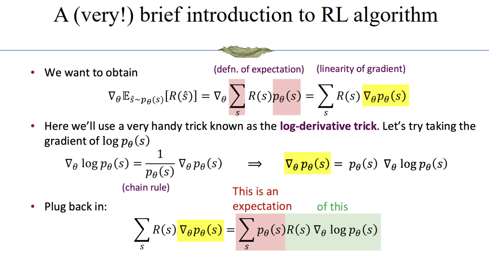
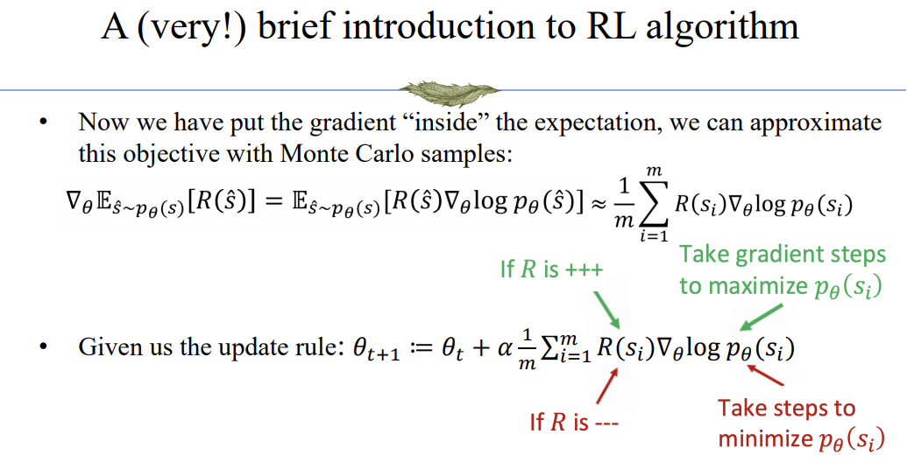
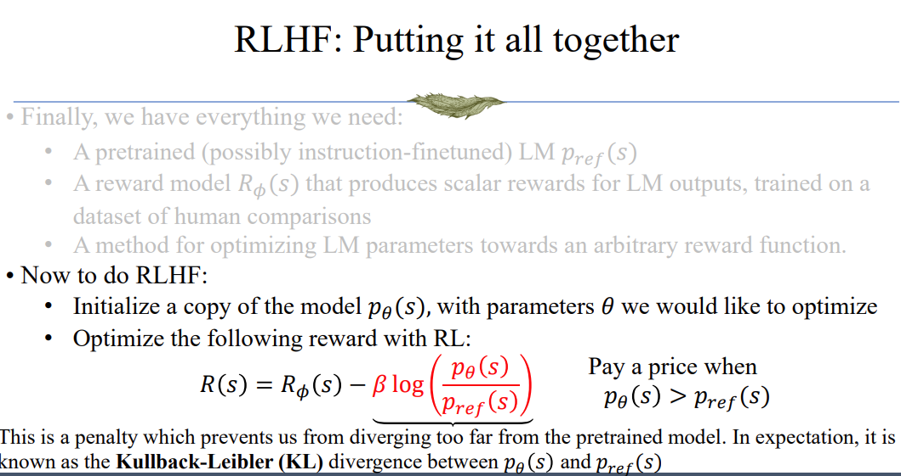
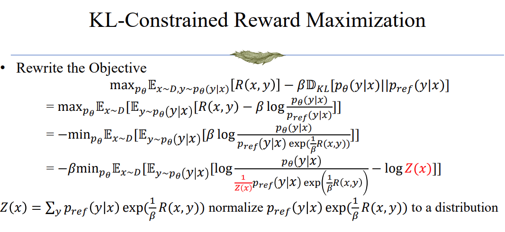
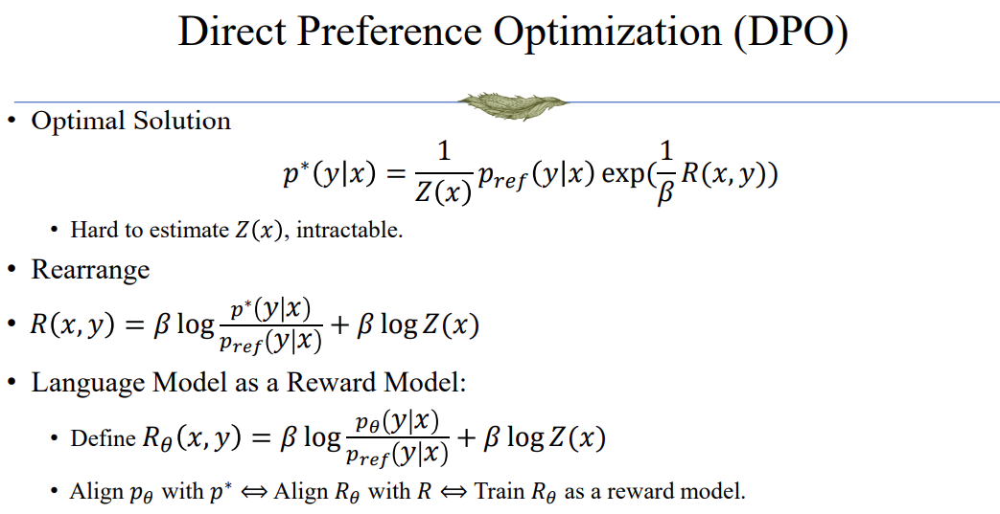
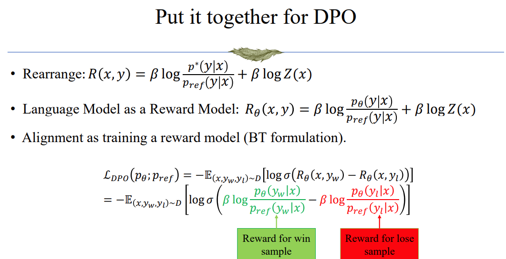

## RLHF

## Limitations of RL+Reward Modeling
- Human preferences are unreliable!
- "Reward hacking" is a common problem in RL
    - model can find shortcut solutions to fool the reward function
- Chatbots are rewarded to produce responses that seem authoritative and helpful, regardless of truth
    - This can result in making up facts + hallucinations

## Direct Preference Optimization (DPO)

DPO is another approach to RL+Reward modeling. The biggest difference is that it doesn't optimize the policy, it directly finds the optimal policy in theory.

## RL with Veriable Reward
- Many tasks are verifiable tasks
    - Math Problems
    - Code Problems

- From Model-based reward model to Rule-based Reward model

- Limitations:
    - Reward hacking: models exploit verifier loopholes, templates, or test case, instead of truly solving the task.
    - Cost & latency: unit tests, sandboxes, and search tasks are expensive and slow.
    - Metric bias: relying on pass@1 alone can mislead; pair with pass@k and process-quality metrics.