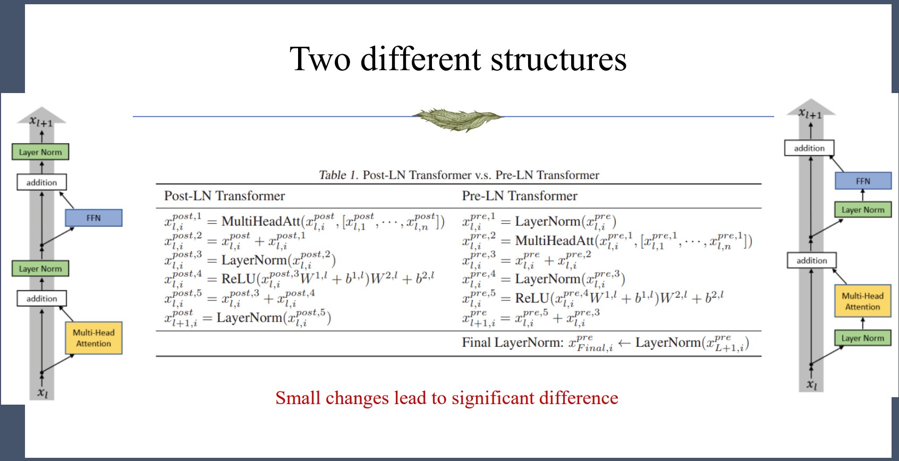
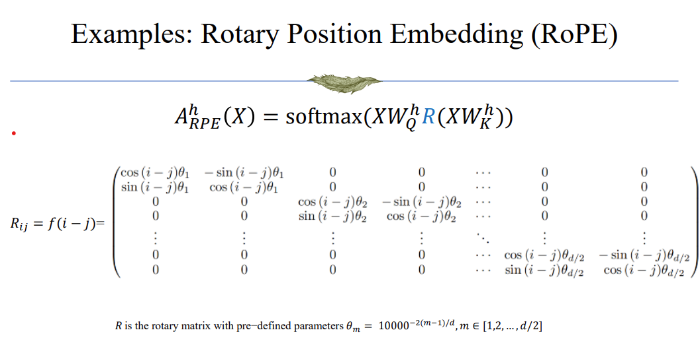

## Self-Attention

1. why divide score by $\sqrt{d_k}$? $d_k$ is the dimension of word embedding.
    - assume $q, k\in \mathbb{R}^{d_k} \sim N(0, 1)$, then $(q^T k) / \sqrt{d_k}$ will also be belongs to $N(0, 1)$. This manipulation helps training, because if we don't normalize, the variance of score may be too large, like 2048, than the sampled score can be something like 100, -100, after softmax, it will ends up being close to 0 or 1. This behavior may be good at the later stage of training, but not good at the beginning, because it asks the model to focus on a specific word(weight nearly equal to 1), but at begining, this word is chosen completely randomly, and training will unable to make progress.

## Feed-Forward Network(FFN)
This component is used to extract feature from the embedding, or "get the sophisticate meaning of the word". One interesting fact is that the extraction is done **per-word**, and it is usually a simple MLP with GeLU(variance of ReLU, non-zero gradient at 0) activation.


## Add and Residual
It's not suprising that residual connection is used to improve gradient flow.

## Layer Normalization
Normalization is carried out per word. We just calculate the mean and variance of each word embedding, and then normalize it.

Why don't we use instance normalization?
- because a sentence may only have one word.

Why don't we use batch normalization?
- because different sentence will have different length. Those sentences too long will have to tailing words that have no peer to compute mean and variance with.

Normalization is commonly used in networks to regularize gradient, prevent too large or too small grandient values, and make training more stable.

## How should these blocks be combined?
the basic idea is FFN is after self-attention and residual connection are placed between them and after FFN. But where should normalization be placed?

There are three options:
1. After residual add.
2. Before residual add, but after self-attention(or FFN).
3. Before self-attention(or FFN).

The second options is not concerned here, I guess it's result of some experiments and it can also be understood as to regularize gradient(just consider normalize before FFN, it will make gradient of the weights in FFN more stable).

For the other two options, the paradigm is like: 

Basically, the conclusion is that option 3 is much better than option 1. Option 1 will make training specifically sensitive to changes in hyperparameters(like learning rate, optimizer), and training methods(like warm up steps) and so on; while option 3 make training more stable and easier to control. The core reason behind this is that in option 1, the gradient distribution of different layers vary a lot(if not doing proper warm up), but in option 3, the gradient distribution is alike for different layers.

## Positional Encoding
There are three different positional encoding methods:
1. Absolute Positional Encoding: the method proposed and used in the original transformer paper(Attention is all you need).
    - key ideas: directly add(literally add operation) manually designed position code vector to the word embedding, only add position encoding at the very beginning of the model.

    - design reasons: the encoding is
        ```math
        p_i = \left( \begin{array}{c} sin(i/10000^{2*1/d}) \\ cos(i/10000^{2*1/d}) \\ \vdots \\ sin(i/10000^{2*{\frac{d}{2}}/d}) \\ cos(i/10000^{2*\frac{d}{2}/d}) \\ \end{array} \right)
        ```
        and it can be seen that $\langle p_i, p_{i+k}\rangle$ is invariant to *i*, so the relevance of positional encoding depends only on the distance between two words.

    - drawbacks: position encoding is only add before the first block, once after non-linear transformation, the idea that position encoding is invariant to i is lost.

    - some works extend absolute position encoding to learned encoding instead of manually designed. But this improve cannot be used on longer sequences. And absolute position the method itself is unable to be extend to more complex scenarios(like images or graph structures, because they are not ordered sequences)

2. Relative Positional Encoding.
    - key ideas: add position encoding in every block. Actually, the encoding is add the the QK score before going through softmax: $$score=softmax(XW_Q(XW_K)^T+B)$$ $B = f(i-j)$ dependes only on relative position.


3. Rotational Positional Encoding: the most popular and successful method in recent Large Transformer models.

    - key ideas: quite like relative position encoding, but it is not added to the score matrix, it applys a rotation matrix to the socre matrix: 
