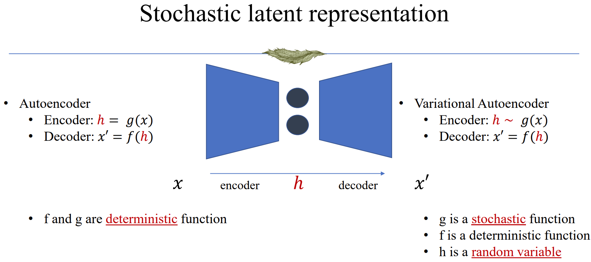
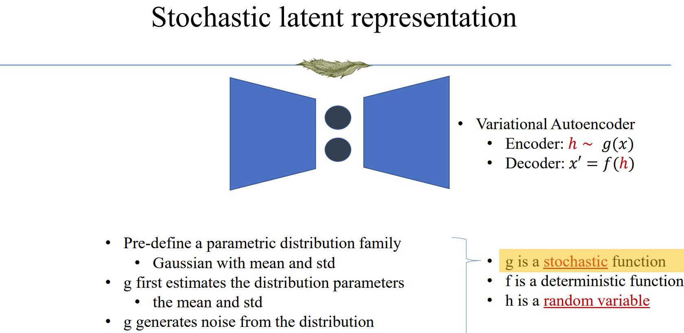

1. Encoder is a stochastic function but decoder is deterministic.
    
    
    This setting seems suitable, but why?
    - I think the decoder is deterministic because: (1) our training method. We ultimately will use L2 loss between generated images and the original images to supervise the training process. Assume the decoder also predicts another sigma beside mu, the only supervised thing will be mu, because the expected outcome of the decoder is always the same image. (2) it makes the training process much harder to make decoder a stochastic function. Because when we have a good mu prediction, it is still possible that the generated image is not close to the original image becuase we will add a noise to it. Similarly, even when the mu is not good, the outcome can still be good if we add a small amount of noise to it. So, it is better to make the decoder deterministic.
    - The encoder is a stochastic function because we want the latent space to be a Gaussian distribution. Making the encoder deterministic will make it more possible that the latent space is not Gaussian. However, even in out situation where latent vector is sampled from predicted mu and sigma, the latent space can still not be a Gaussian distribution, just think about the extreme situation where all predicted mu are positive. That why besided reconstruction loss, we also have KL loss to guarantee the latent space is approximately a Gaussian distribution.