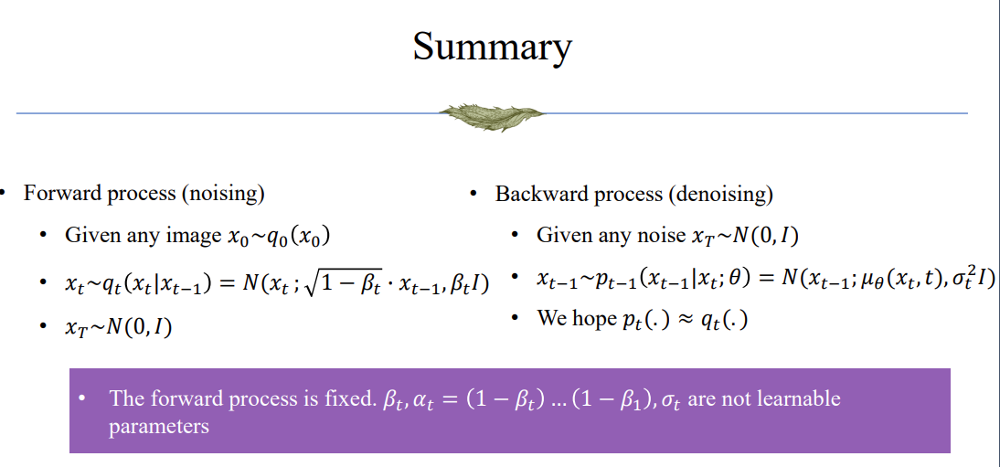
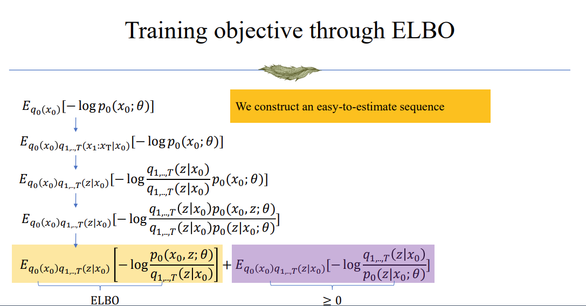
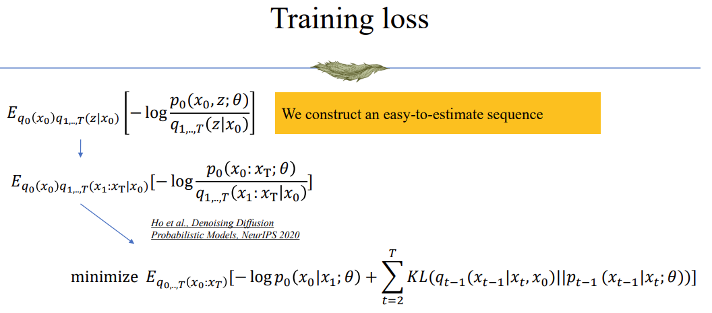
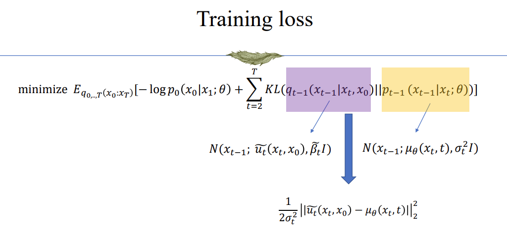
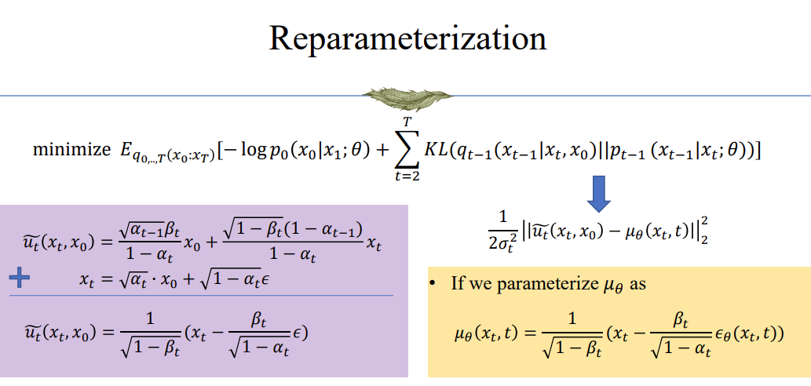
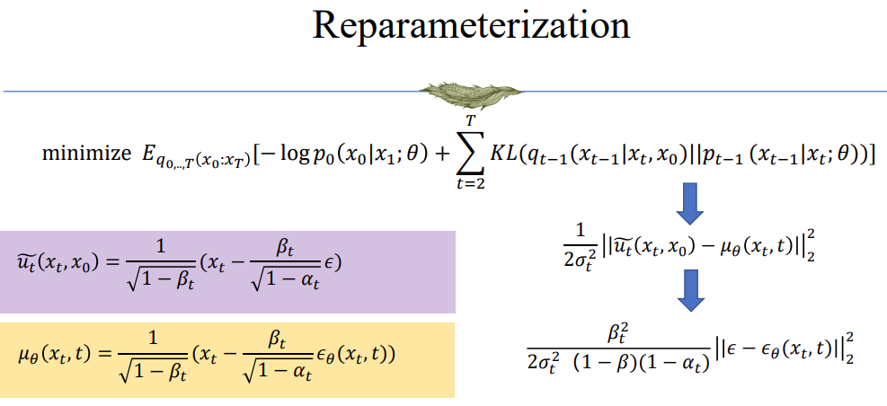
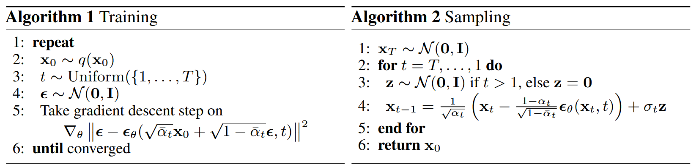
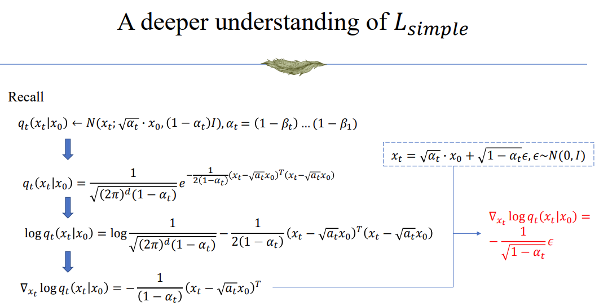

## Overview

Diffusion models are the currently most powerful models:
- Produce high-quality and diverse images
- No problem of mode collapse
- Easy to train

## Forward and Backward Process in Diffusion Models


## Some important equations
1. $x_{t} = \sqrt{\alpha_{t}}x_0 + \sqrt{1-\alpha_{t}}\epsilon_t, \epsilon_t \sim N(0, I)$, where $\alpha_t=\prod_{i=1}^{t}(1-\beta_t)$. Proof:

```math
\begin{align*}
    x_{t+1} &= \sqrt{1-\beta_{t+1}}x_t + \sqrt{\beta_{t+1}}\tilde{\epsilon}_{t+1} \\
    &= \sqrt{1-\beta_{t+1}}(\sqrt{\alpha_t}x_0 + \sqrt{1-\alpha_t}\epsilon_t) + \sqrt{\beta_{t+1}}\tilde{\epsilon}_{t+1} \\
    &= \sqrt{\alpha_{t+1}}x_0 + \sqrt{(1-\beta_{t+1})(1-\alpha_t)}\epsilon_t + \sqrt{\beta_{t+1}}\tilde{\epsilon}_{t+1} \\
    &= \sqrt{\alpha_{t+1}}x_0 + \mathcal{N}(0, (\sqrt{(1-\beta_{t+1})(1-\alpha_t)})^2+(\sqrt{\beta_{t+1}})^2) \\
    &= \sqrt{\alpha_{t+1}}x_0 + \mathcal{N}(0, 1-\alpha_{t+1}) \\
    &= \sqrt{\alpha_{t+1}}x_0 + \sqrt{1-\alpha_{t+1}}\epsilon_{t+1} \\
\end{align*}
```

2. $q(x_{t-1}|x_t,x_0) = \mathcal{N}(x_{t-1};\tilde{\mu}_t(x_t, x_0),\tilde{\beta}_tI)$, where

```math
\begin{align*}
\tilde{\mu}_t(x_t, x_0) &:= \frac{\sqrt{\bar{\alpha}_{t-1}}\beta_t}{1-\bar{\alpha}_{t}}x_0 + \frac{\sqrt{\alpha_t}(1-\bar{\alpha}_{t-1})}{1-\bar{\alpha}_t}x_t \\
\tilde{\beta}_t &:= \frac{1-\bar{\alpha}_{t-1}}{1-\bar{\alpha}_t}\beta_t \\
\bar{\alpha}_t &:= \prod_{i=1}^{t}(1-\beta_t) \\
\alpha_t &:= 1-\beta_t
\end{align*}
```

## Training







- **NOTE:** We can notice that there is a term $-\log p(x_0|x_1; \theta)$ in the loss that is not dealt with here. Actually, $p(x_0|x_1)$ is specially processed, so it is not included in the training process shown above.


## diffusion and score function


