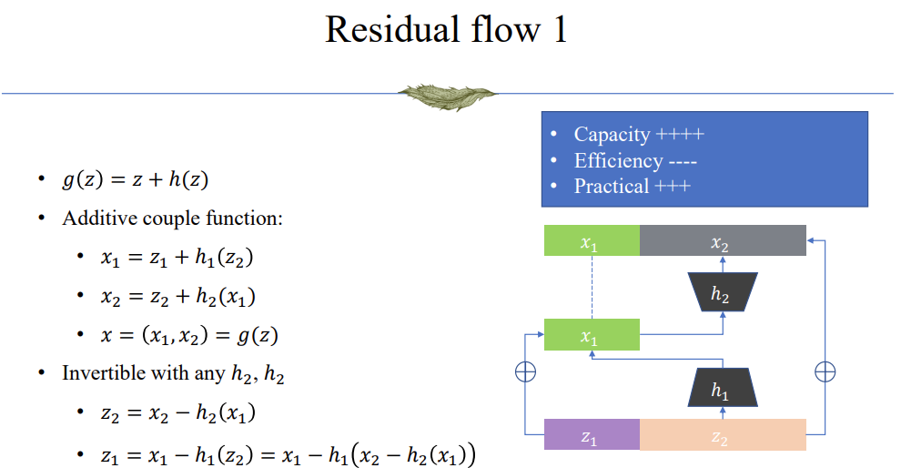
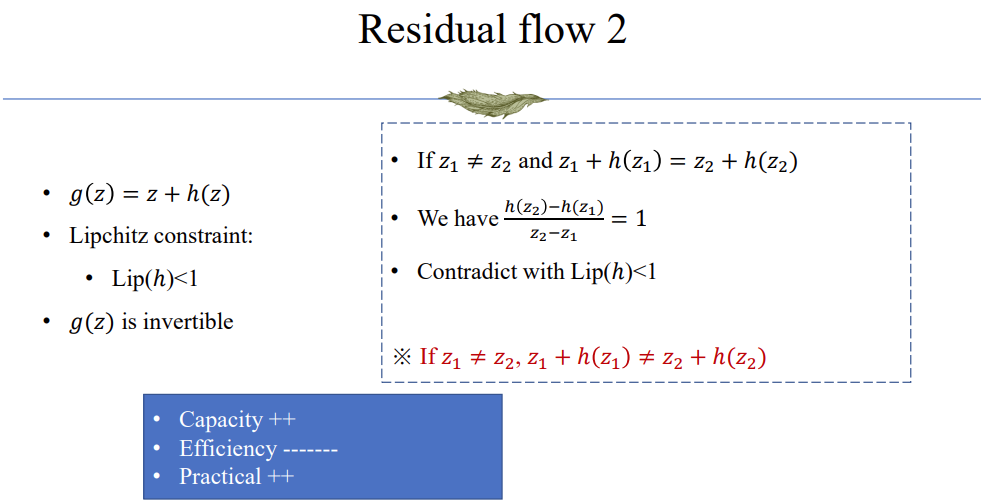
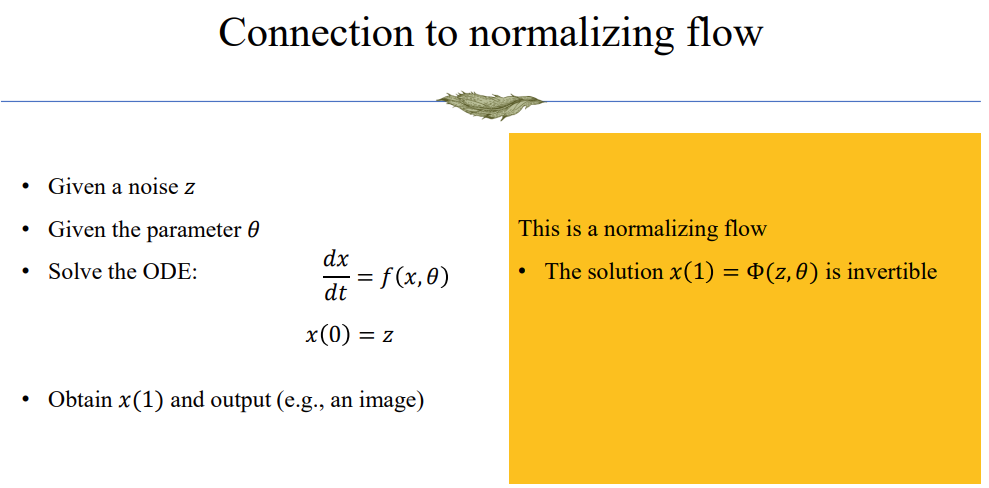
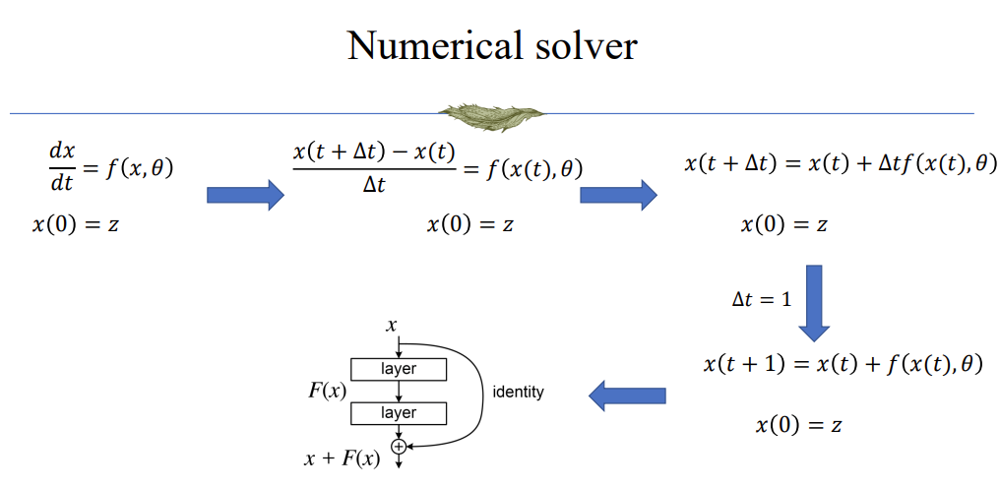

## The change of variables theorem
- $Z\in R^d$ is a random vector with probability density $p_Z(z)$
- $X = g(Z)\in R^d$ is a random vector with probability density $p_X(x)$
    - $g: R^d\to R^d$ is invertible
    - $g$ and $g^{-1}$ are differentiable
- $x=g(z)=(g_1(z_1,\ldots,z_d),\ldots, g_d(z_1,\ldots,z_d))$
- $p_X(x) = p_Z(g^{-1}(x))|\det D_{g^{-1}}(x)|$, where

```math
D_g(z) = \frac{\partial(g_1, g_2, \ldots, g_d)}{\partial(z_1, z_2, \ldots, z_d)} = \begin{bmatrix}
\frac{\partial g_1}{\partial z_1} & \cdots & \frac{\partial g_1}{\partial z_d}\\
\vdots & \ddots & \vdots\\
\frac{\partial g_d}{\partial z_1} & \cdots & \frac{\partial g_d}{\partial z_d}
\end{bmatrix}
```

## How to understand "Normalizing"

The flow in the model:

```math
x\rightarrow f(x)=g^{-1}\rightarrow z\sim N(0, I)\rightarrow g(z)=f^{-1}\rightarrow x
```

The previous part from $x$ to $z$ shows that the inverse function $f=g^{-1}$ **normalizes** a complex distribution $p(X)$ to a more regular form of simple distribution $p(Z)$; while the later part from $z$ to $x$ show that the generator $g$ pushes forward the base density $p(Z)$ to a more complex density $p(X)$.

So, the "normalizing" in the model means that we are transforming a complex distribution to a simple distribution, and the "flow" means that we are pushing one distribution to another distribution.

## Training method

Normalizing flow models use MLE to learn the transformation, and the loss is formulated as:

```math
\begin{align*}
NLL = & -\sum \log p_X(x_i) \\
    = & -\sum \log p_Z(z_i)|\det D_{g^{-1}}(x_i)| \\
    = & -\sum \log p_Z(g^{-1}(x_i))|\det D_{g^{-1}}(x_i)| \\
\end{align*}
```

In practice, when can either model $f$ (the normalizing process) or $g$ (the generating process). That depends on the task we are performing.

### 1. density estimation
- Goal of density estimation
    - Given a sample $x$
    - Feed $x$ into a model
    - Output an estimation of $p(x)$

- Scenarios
    - Assume I have a set of generated image, I want to select the “best quality” one.
    - anomaly detection
    - novelty detection

- calculation:
    - $p_X(x) = p_Z(f(x))|\det D_{f}(x)|$
    - $p_X(x) = p_Z(g^{-1}(x))|\det D_{g^{-1}}(x)|$
    - For density estimation, parameterizing $f$ is generally preferred as the estimation doesn't require the calculation of the inverse

### 2. sampling
- Goal of sampling
    - Given noise $z$
    - Feed $z$ into a model
    - Output a sample of complex distribution $p(x)$

- Scenarios
    - generative models

- calculation:
    - $p_X(x) = p_Z(z)|\det D_{g}(z)|^{-1}$
    - $p_X(x) = p_Z(z)|\det D_{f^{-1}}(z)|^{-1}$
    - For sampling, parameterizing $g$ is generally preferred as the sampling doesn't require the calculation of the inverse

## Challenge
In Normalizing Flows, we seek to find a function class, where the functions in the class are convenient to compute, invert, and calculate the determinant of their Jacobian.

It's usually hard to directly construct such a function, so we use composition of invertible functions to solve this:
- Assume we have $g_1$ and $g_2$ defined as in previous slides
- $g_1$ and $g_2$ satisfy all the conditions
- Consider $g_z = g_2(g_1(z))$
    - $g_z$ is invertible: $g^{-1}=g_1^{-1}g_2^{-1}$
    - $g$ and $g^{-1}$ are differentiable

Usually used invertible functions:
1. ELementwise flow:
    - $g(z) = (h(z_1), h(z_2), \ldots, h(z_d))$
    - if $h$ is invertible, then $g$ is invertible
    - $h$ can be any reasonable activation function

2. Linear flows:
    - $g(z) = Az + b$
    - if $A$ is invertible, then $g$ is invertible
        - $g^{-1}(x) = A^{-1}(x-b)$
    - $D_g(z) = A, \det D_{g^{-1}}(x) = \det A^{-1}$
    - $\det D_g(z) = |A|, \det D_{g^{-1}}(x) = |A^{-1}|$
    - because computing inverse of a matrix is expensive, so linear flow usually has low efficiency
    - Setting $A$ as triangular matrix or orthogonal matrix can make the computation more efficient.
        - if $A$ is orthogonal, $Householder transform$ needs to be used during training to restrict $A$ is orthogonal.

3. Residual flow
    
    


## Continuous Flow



