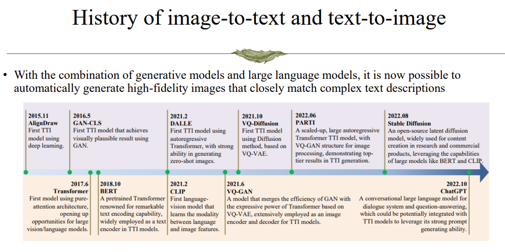
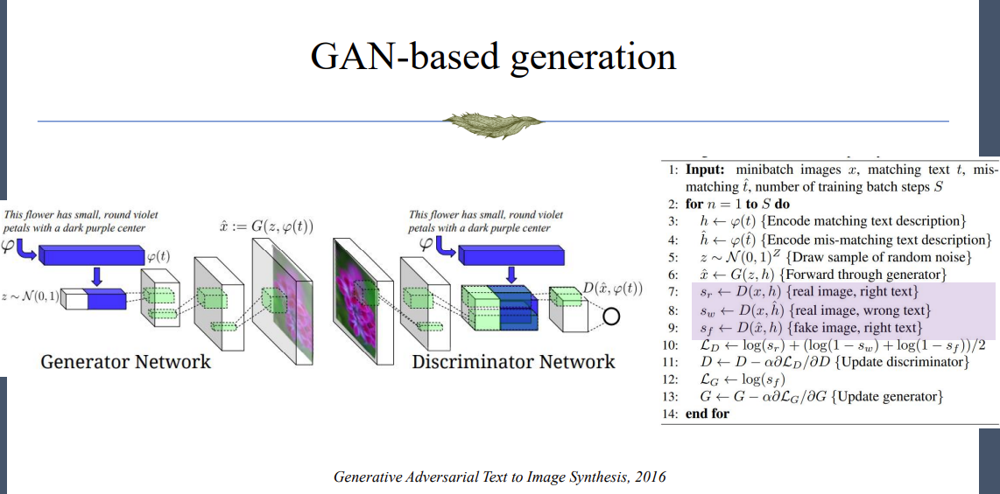
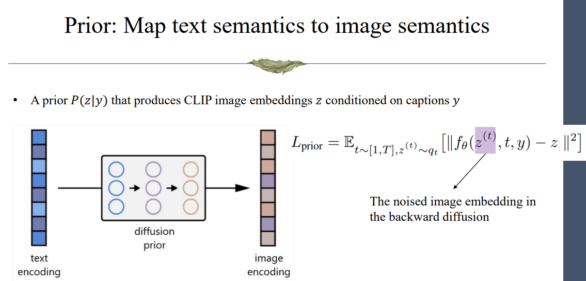
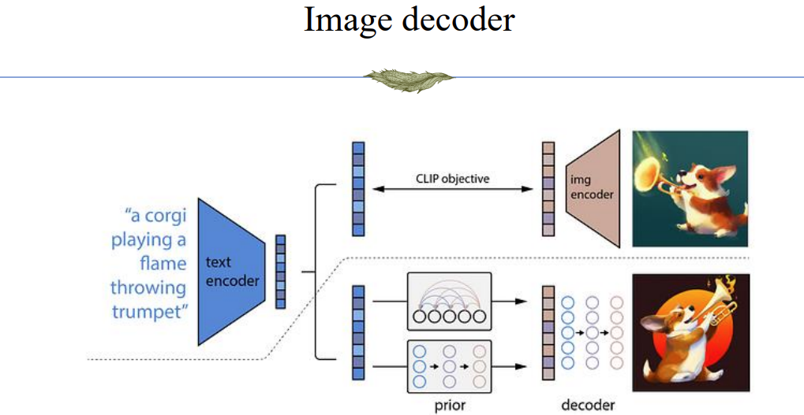

## history


## Text-2-Image
Famous models
- DALL·E
    - Usage: https://github.com/openai/DALL-E
    - Source code NOT released
    - Not diffusion model
- GLIDE
    -  Open-sourced https://github.com/openai/glide-text2im
- DALL·E-2
    - Usage: https://openai.com/dall-e-2/
    - Unofficial code: https://github.com/lucidrains/DALLE2-pytorch

## Text-Image Alignment
- Large language model as “General Artificial Intelligence”
    - Solving all natural language tasks through prompting

- Vision model
    - Classification, segmentation, detection, captioning
    - Unsupervised learning through contrastive learning and autoencoder + finetuning

- How to make a vision model that can solve many tasks?
    - Vision + Language
    - Understand vision through language and solve tasks
    - Multi-modal model requires vision-language alignment

- Data statistics
    - Large-scale image-text pairs in the Internet
    - 400 million pairs retrieved from the Web without human labelling
    - Comparison
        - ImageNet classification dataset：1 million images
        - MS-COCO image captioning dataset：0.1 million images

- famous models
    - CLIP
        - Usage: https://github.com/openai/CLIP
        - https://www.assemblyai.com/blog/how-dall-e-2-actually-works/
    
## Text Guided Image Generation

1. GAN based
    - basic pipeline:
    

    - latest GAN-based generation: "Scaling up GANs for Text-to-Image Synthesis"

2. AR based
    - basic pipeline:
        - Encode input text to text token sequence
        - Learn a codebook using discrete/vector quantized VAE
        - Encode the image to image token sequence
        - Concatenate the text tokens and image tokens
        - Train the model via next token prediction task

    - latest AR-based generation: "Scaling Autoregressive Models for Content-Rich Text-to-Image Synthesis"

3. Diffusion based
    - basic pipeline:
        - Given a text sequence $y$, the goal is to generate an image $x$ correspond to the text

            ```math
            P(x|y)
            ```
        
        - Denote $z$ as the image encoding from CLIP

            ```math
            z = CLIP(x)
            ```

        - We decompose the generation process into two steps

            ```math
            P(x|y) = P(x,z|y) = P(x|y,z)P(z|y)
            ```

        - The first step $P(z|y)$ is called a prior, which use a diffusion to bridge the CLIP embedded text tokens and the CLIP embedded image tokens
        

        - The second step $P(x|y,z)$ is called a decoder, it can be any models.
        

    - latest Diffusion-based generation: "Hierarchical Text-Conditional Image Generation with CLIP Latents"